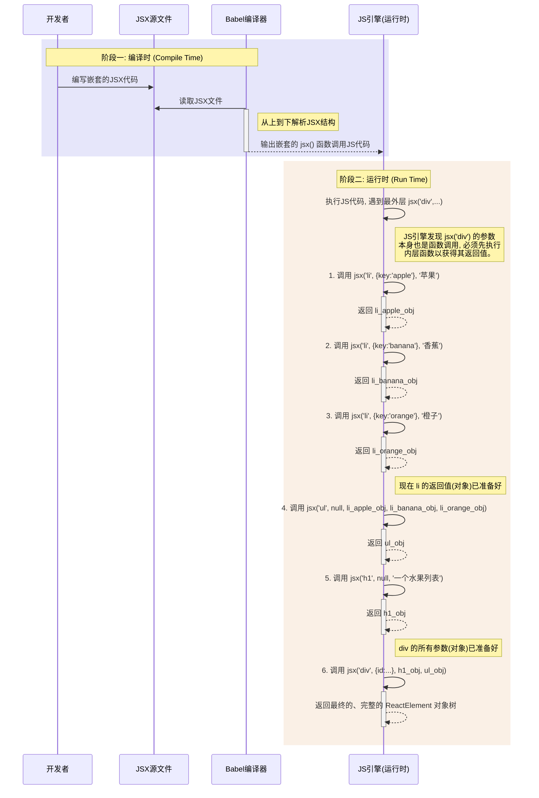

好的，我们来创建一个嵌套的JSX，并按照 **JSX -\> Babel -\> ReactElement** 的顺序，结合你提供的 `jsx()` 函数来详细讲解这个过程。

-----

### 1\. 嵌套的 JSX 示例 📝

首先，我们定义一个比你的例子更复杂一些的嵌套JSX结构。这个结构代表一个简单的列表组件。

```jsx
<div id="container" className="list-wrapper">
  <h1>一个水果列表</h1>
  <ul>
    <li key="apple" ref={el => console.log(el)}>苹果</li>
    <li key="banana">香蕉</li>
    <li key="orange">橙子</li>
  </ul>
</div>
```

这个JSX结构包含：

  * 一个带有 `id` 和 `className` 的顶层 `div`。
  * `div` 的子元素是一个 `h1` 和一个 `ul`。
  * `ul` 内部有三个 `li` 子元素。
  * `li` 元素拥有 `key` 属性，并且第一个 `li` 还有一个 `ref` 属性，用以演示你代码中的 `key` 和 `ref` 提取逻辑。
  * `h1` 和 `li` 元素都包含文本子节点。

-----

### 2\. Babel 编译结果 ⚙️

当Babel编译器（配置了React JSX转换）遇到上面的JSX时，它会将其转换为一系列嵌套的 `jsx()` 函数调用（在旧的转换中是 `React.createElement()`）。你的 `jsx` 函数签名是 `jsx(type, config, ...maybeChildren)`，所以转换结果如下：

```javascript
// 注意：为了清晰，这里我们假设你的函数名叫 jsx，而不是 React.createElement
// Babel 会将 JSX 转换为如下的 JavaScript 代码

jsx(
  "div", // type
  { id: "container", className: "list-wrapper" }, // config
  jsx(
    "h1", // type
    null, // config (没有属性)
    "一个水果列表" // children
  ),
  jsx(
    "ul", // type
    null, // config (没有属性)
    jsx(
      "li", // type
      { key: "apple", ref: el => console.log(el) }, // config
      "苹果" // children
    ),
    jsx(
      "li", // type
      { key: "banana" }, // config
      "香蕉" // children
    ),
    jsx(
      "li", // type
      { key: "orange" }, // config
      "橙子" // children
    )
  )
);
```

**关键点**：

  * 每个XML标签都变成了对 `jsx()` 函数的调用。
  * 标签名 (`div`, `h1`, `ul`, `li`) 成为第一个参数 `type`。
  * 标签的属性 (attributes) 被收集到一个对象中，成为第二个参数 `config`。如果标签没有属性，这个参数就是 `null`。
  * 标签的子元素（包括其他标签和文本节点）成为从第三个参数开始的剩余参数 `...maybeChildren`。

-----

### 3\. 生成 ReactElement 对象的过程 🔬

现在，我们来一步步追踪上面那段由Babel生成的代码是如何通过你的 `jsx()` 和 `ReactElement()` 函数，最终生成一个嵌套的JS对象的。

JavaScript函数的执行顺序是 **从内到外** 的。所以，最内层的 `jsx('li', ...)` 会最先执行。

#### **第1步：创建最内层的 `<li>` 元素**

以第一个 `li` 为例：
`jsx('li', { key: 'apple', ref: el => console.log(el) }, '苹果')`

1.  **进入 `jsx` 函数**:

      * `type` = `'li'`
      * `config` = `{ key: 'apple', ref: el => console.log(el) }`
      * `maybeChildren` = `['苹果']` (一个长度为1的数组)

2.  **处理 `config`**:

      * 初始化 `key = null`, `props = {}`, `ref = null`。
      * 循环 `config` 对象：
          * 遇到 `k = 'key'`，`key` 被赋值为 `'apple'`，然后 `continue`。
          * 遇到 `k = 'ref'`，`ref` 被赋值为 `el => console.log(el)` 函数，然后 `continue`。
      * 循环结束后，`key` 和 `ref` 变量已保存特殊属性，`props` 对象此刻仍为空 `{}`。

3.  **处理 `children`**:

      * `maybeChildren.length` 等于 1。
      * 执行 `props.children = maybeChildren[0]`。
      * 因此，`props.children` 被赋值为字符串 `'苹果'`。
      * 现在的 `props` 对象是 `{ children: '苹果' }`。

4.  **调用 `ReactElement` 函数**:

      * 调用 `ReactElement('li', 'apple', el => console.log(el), { children: '苹果' })`。
      * `ReactElement` 函数返回如下对象：
        ```json
        {
          "$$typeof": Symbol.for('react.element'),
          "type": "li",
          "key": "apple",
          "ref": "el => console.log(el)", // 实际上是一个函数
          "props": {
            "children": "苹果"
          }
        }
        ```
      * 其他两个 `li` 元素也通过类似的过程被创建。

#### **第2步：创建 `<ul>` 和 `<h1>` 元素**

现在，轮到外层的调用了。

1.  **创建 `<h1>`**: `jsx('h1', null, '一个水果列表')`

      * 这个过程很简单，`config` 为 `null`，`props` 最终为 `{ children: '一个水果列表' }`。
      * 返回的 `ReactElement` 对象如下：
        ```json
        {
          "$$typeof": Symbol.for('react.element'),
          "type": "h1",
          "key": null,
          "ref": null,
          "props": {
            "children": "一个水果列表"
          }
        }
        ```

2.  **创建 `<ul>`**:
    `jsx('ul', null, li_element_1, li_element_2, li_element_3)`

      * 注意，这里的 `li_element_...` 是 **第1步中已经生成好的 `ReactElement` 对象**。
      * **进入 `jsx` 函数**:
          * `type` = `'ul'`
          * `config` = `null`
          * `maybeChildren` = `[li_element_1, li_element_2, li_element_3]` (一个长度为3的数组)
      * **处理 `config`**: `props` 保持为 `{}`。
      * **处理 `children`**:
          * `maybeChildren.length` 是 3，不等于 1。
          * 执行 `props.children = maybeChildren`。
          * `props.children` 被赋值为包含三个 `li` 对象的数组。
      * **调用 `ReactElement`** 返回如下对象：
        ```json
        {
          "$$typeof": Symbol.for('react.element'),
          "type": "ul",
          "key": null,
          "ref": null,
          "props": {
            "children": [
              { "$$typeof": ..., "type": "li", "key": "apple", ... },
              { "$$typeof": ..., "type": "li", "key": "banana", ... },
              { "$$typeof": ..., "type": "li", "key": "orange", ... }
            ]
          }
        }
        ```

#### **第3步：创建顶层的 `<div>` 元素**

这是最外层的调用：
`jsx('div', { id: 'container', className: 'list-wrapper' }, h1_element, ul_element)`

  * 这里的 `h1_element` 和 `ul_element` 是第2步中生成好的对象。

  * **进入 `jsx` 函数**:

      * `type` = `'div'`
      * `config` = `{ id: 'container', className: 'list-wrapper' }`
      * `maybeChildren` = `[h1_element, ul_element]` (长度为2的数组)

  * **处理 `config`**:

      * 循环 `config`，将 `id` 和 `className` 填充到 `props` 对象中。
      * `props` 变为 `{ id: 'container', className: 'list-wrapper' }`。

  * **处理 `children`**:

      * `maybeChildren.length` 是 2，不等于 1。
      * `props.children` 被赋值为 `[h1_element, ul_element]` 数组。

  * **最终 `ReactElement` 对象**:
    调用 `ReactElement` 后，返回最终的、完全嵌套的 `ReactElement` 对象树。

    ```json
    {
      "$$typeof": Symbol.for('react.element'),
      "type": "div",
      "key": null,
      "ref": null,
      "props": {
        "id": "container",
        "className": "list-wrapper",
        "children": [
          {
            "$$typeof": Symbol.for('react.element'),
            "type": "h1",
            "key": null,
            "ref": null,
            "props": { "children": "一个水果列表" }
          },
          {
            "$$typeof": Symbol.for('react.element'),
            "type": "ul",
            "key": null,
            "ref": null,
            "props": {
              "children": [
                { "$$typeof": Symbol.for('react.element'), "type": "li", "key": "apple", "ref": "...", "props": { "children": "苹果" } },
                { "$$typeof": Symbol.for('react.element'), "type": "li", "key": "banana", "ref": null, "props": { "children": "香蕉" } },
                { "$$typeof": Symbol.for('react.element'), "type": "li", "key": "orange", "ref": null, "props": { "children": "橙子" } }
              ]
            }
          }
        ]
      }
    }
    ```

-----

### 逻辑流程图 (Mermaid)

下面是整个过程的逻辑流程图。

