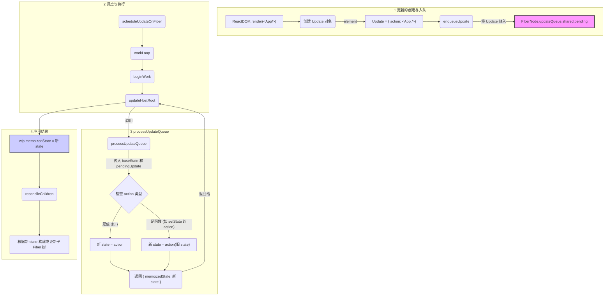

## 1. 创建更新 -> reconcileChildren

- 创建更新
- workLoop
  - beginWork
    - updateHostRoot
      - reconcileChildren

```mermaid
graph TD
    subgraph "1 更新的创建与入队"
        A["ReactDOM.render(&lt;App/&gt)"] --> B(创建 Update 对象);
        B -- "element" --> C["Update = { action: &lt;App /&gt;}"];
        C --> D(enqueueUpdate);
        D -- "将 Update 放入" --> E[FiberNode.updateQueue.shared.pending];
    end

    subgraph "2 调度与执行"
        F(scheduleUpdateOnFiber) --> G(workLoop);
        G --> H(beginWork);
        H --> I(updateHostRoot);
    end

    subgraph "3 processUpdateQueue"
        I -- "调用" --> J(processUpdateQueue);
        J -- "传入 baseState 和 pendingUpdate" --> K{检查 action 类型};
        K -- "是值 (如 <App/>)" --> L[新 state = action];
        K -- "是函数 (如 setState 的 action)" --> M["新 state = action(旧 state)"];
        L --> N("返回 { memoizedState: 新 state }");
        M --> N;
    end

    subgraph "4 应用结果"
        N -- "返回给" --> I;
        I --> O[wip.memoizedState = 新 state];
        O --> P(reconcileChildren);
        P --> Q[根据新 state 构建或更新子 Fiber 树];
    end

    style E fill:#f9f,stroke:#333,stroke-width:2px
    style O fill:#ccf,stroke:#333,stroke-width:2px
```

## 2. reconcileChildren

## 3. completeWork

此时 wip = fiberNode(<App />)
