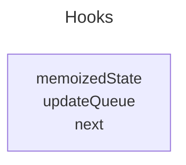
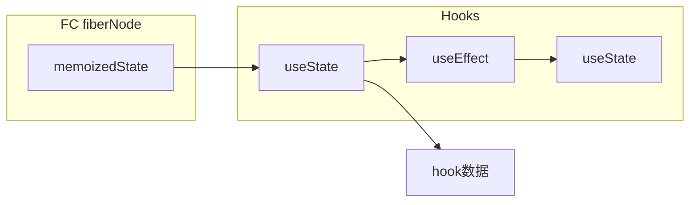

fiberNode.updateQueue
fiberNode.memoizedState

### Hook 的数据结构

#### 直观

**内部结构**

**外部联系**

#### 概念

- `memoizedState`
  - 存储的是**当前这个特定 Hook 实例的核心数据**
  - **对于 `useState` Hook**: `memoizedState` 存储的就是你通过 `useState` 获取到的那个状态变量的**当前值**。例如，如果你写 `const [count, setCount] = useState(0);`，那么这个 `Hook` 对象的 `memoizedState` 就会是 `0` (或者之后通过 `setCount` 更新后的值)。
  - **对于 `useEffect` Hook**: `memoizedState` 存储的是一个 `Effect` 对象。这个 `Effect` 对象包含了副作用的创建函数 (`create`)、销毁函数 (`destroy`)、依赖项 (`deps`) 以及一个指向下一个 `Effect` 对象的指针（因为一个组件可以有多个 `useEffect`，它们也会形成一个链表，但这个链表是挂载在 `FiberNode.updateQueue` 上的，而不是直接在 `Hook.memoizedState` 里形成链表）。
- `updateQueue`
  - 存储与该 Hook 相关的**更新队列**
  - **对于 `useState` Hook**: `updateQueue` 会指向一个 `UpdateQueue` 对象。这个队列负责管理所有通过 `setState` (或 `dispatch` 函数) 针对这个特定状态发起的更新请求。当组件重新渲染时，React 会处理这个队列中的更新来计算新的 `memoizedState`。
  - **对于 `useEffect` Hook**: 这个属性通常是 `null` 或者不被直接使用来存储更新队列。`useEffect` 的副作用执行逻辑（创建、销毁、依赖比较）更多地依赖于其 `memoizedState` 中存储的 `Effect` 对象以及 FiberNode 上的 `updateQueue` (类型为 `FCUpdateQueue`) 来管理 `Effect` 链表。
- `next`
