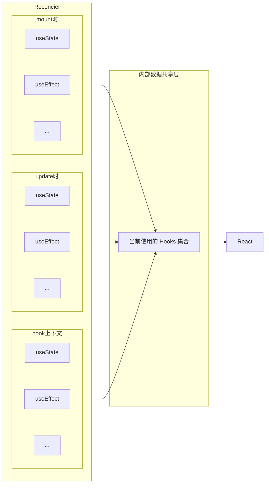

感知上下文的能力:

- hooks 不能脱离 FC 的上下文
- 一个 useState 怎么知道 自己是在 useEffect 的回调函数的环境中呢(不能这样)

感知 mount/update:

解决：

不同上下文的环境中，调用的 hooks 其实不是同一个
->
需要用 react-reconciler 感知上下文
->
需要共享数据(react 包与 react-reconciler包)

