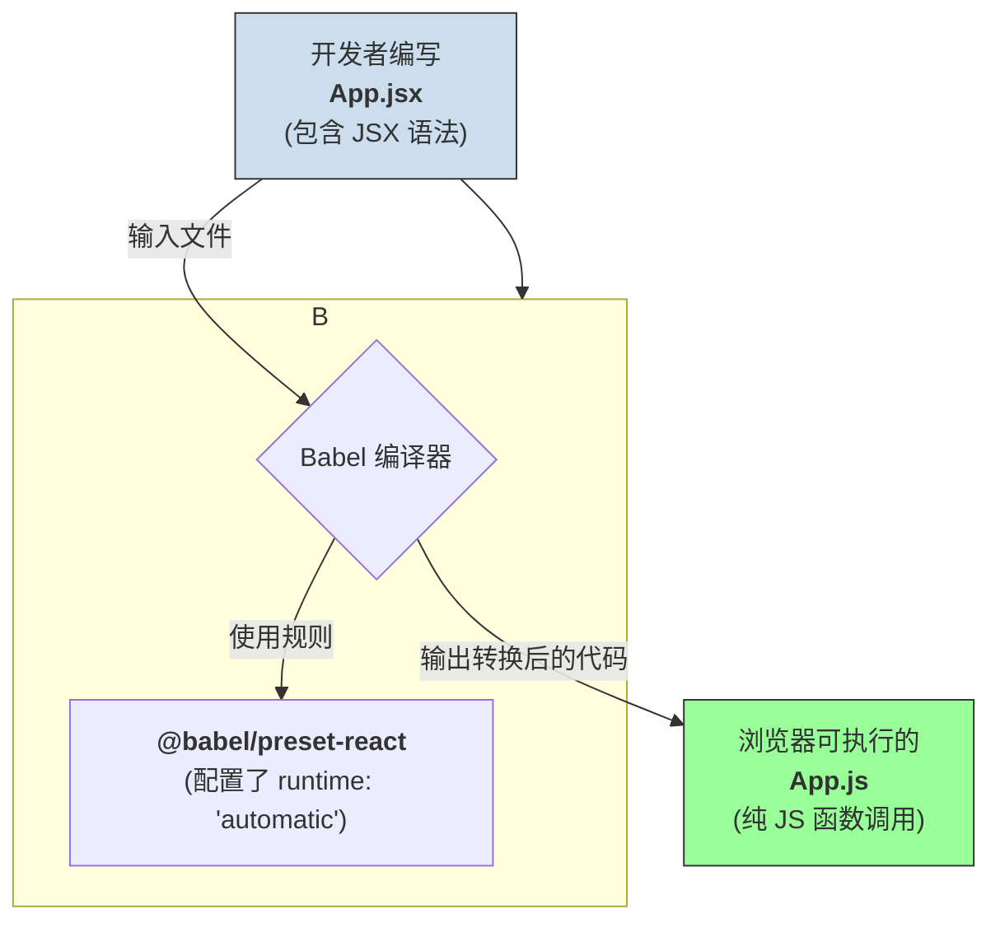

Babel **不是在运行时（runtime）去“调用”** `jsx` 函数的。更准确地说，Babel 是一个**编译器（Compiler）**，它在**构建时（build time）**，也就是在你运行 `npm run dev` 或者 `npm run build` 的时候，**将你写的 JSX 语法，直接改写成对 `jsx` 函数的普通 JavaScript 调用**。

这个过程就像翻译：你用中文（JSX）写文章，Babel 把它翻译成英文（纯 JavaScript 函数调用），这样浏览器这个只会说英文的读者才能看懂。

-----

### 核心原理：从“语法糖”到“函数调用”

浏览器本身不认识 `<div id="app">` 这种 JSX 语法。对于浏览器来说，这会直接导致语法错误。

Babel 的作用，就是找到你代码里所有这种“长得像 HTML 的语法”，然后根据一套预设的规则，把它们转换成标准的、浏览器认识的 JavaScript。

这个转换规则的核心，由一个叫 `@babel/preset-react` 的预设来提供。

#### **关键配置：`runtime: 'automatic'`**

在现代的 React 项目中，`@babel/preset-react` 的默认配置是 `runtime: 'automatic'`。这个配置告诉 Babel：

1.  **目标函数**：当你看到 JSX 语法时，请把它转换成对 `jsx` 或 `jsxs` 函数的调用。
2.  **自动导入**：你不仅要转换，还要在文件的顶部自动帮我加上 `import { jsx } from 'react/jsx-runtime'` 这样的导入语句。

这也就是为什么在新版 React 中，你不再需要在每个写了 JSX 的文件里手动 `import React from 'react'`。

-----

### 举例说明：一步步看清转换过程

让我们用一个具体的例子，看看 Babel 究竟做了什么。

#### **第 1 步：开发者编写的 JSX 代码**

假设你在 `App.js` 文件里写了这样的代码：

```jsx
// App.js
function App() {
  return (
    <div id="main" className="container">
      <h1>你好，世界</h1>
    </div>
  );
}
```

#### **第 2 步：Babel 在构建时介入**

当你保存文件或执行构建命令时，Webpack 或 Vite 等构建工具会调用 Babel 来处理这个 `App.js` 文件。Babel 看到里面的 JSX，就会开始“翻译”。

#### **第 3 步：Babel 编译后的 JavaScript 代码**

Babel 会输出如下内容的纯 JavaScript 文件，这才是最终会打包进浏览器运行的代码：

```javascript
// 这是 App.js 经过 Babel 编译后的样子
import { jsx as _jsx } from "react/jsx-runtime";
import { jsxs as _jsxs } from "react/jsx-runtime";

function App() {
  return (
    // 注意看这里！
    _jsxs("div", {
      id: "main",
      className: "container",
      children: [
        _jsx("h1", { children: "你好，世界" })
      ]
    })
  );
}
```

**我们来仔细分析这个转换结果：**

1.  **自动导入**：文件顶部被自动注入了 `import { jsx as _jsx, jsxs as _jsxs } from "react/jsx-runtime"`。
      * `jsx` 用于处理只有一个子元素的 JSX。
      * `jsxs` (s for static) 是一个优化，用于处理有多个静态子元素（比如我们例子中的 `h1`）的情况，可以避免一些不必要的数组创建。
2.  **标签名 `<div>`** -\> 变成了函数的**第一个参数 `'div'`**。
3.  **所有属性** `id="main" className="container"` -\> 被收集成一个对象，作为函数的**第二个参数** `{ id: "main", className: "container", ... }`。
4.  **所有子元素** `<h1>...</h1>` -\> 被放进一个数组里，作为 `children` 属性，成为第二个参数对象的一部分。
5.  **嵌套的 JSX**：子元素 `<h1>` 本身也被递归地转换成了 `_jsx("h1", { children: "你好，世界" })`。

#### **流程图**

这个过程可以用一个流程图清晰地表示：



### 总结

所以，Babel 调用 `jsx` 的方式，本质上是一种**代码转换（Code Transformation）**。它在代码执行之前，就通过静态分析，把 JSX 这种声明式的语法糖，转换成了对 `jsx()` / `jsxs()` 函数的直接调用。

您之前提供的那段 `jsx` 函数代码，其职责正是在**运行时**，接收并处理这些由 Babel 生成好的函数调用，最终在内存中创建出 React 工作流所需要的 `ReactElement` 对象。