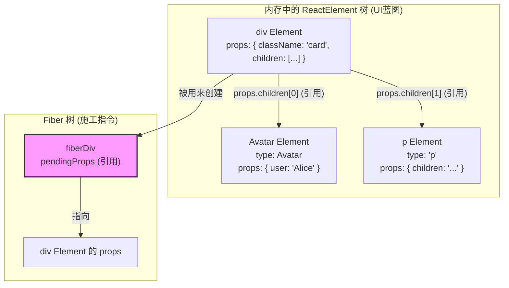

好的，我们之前确实深入探讨过 React 源码的许多方面，从 JSX 的编译到最终的 `ReactElement` 对象结构。很高兴能在此基础上，通过一个具体的例子来巩固您提到的这三个重点。

这三个重点完美地概括了 React 从“蓝图”到“施工指令”的核心流程，我们用一个简单的例子来把它们串起来。

### 示例代码

假设我们有这样一个 JSX 结构，它代表一个简单的用户卡片组件：

```jsx
// App.js
function App() {
  return (
    <div className="card">
      <Avatar user="Alice" />
      <p>点击查看详情</p>
    </div>
  );
}

function Avatar({ user }) {
  return (
    
  );
}
```

现在，让我们用您总结的三个重点来一步步剖析这个过程。

-----

### 👉 重点 1 的体现：从 JSX 到 React Element 树是一次性、同步完成的

当 `App` 组件被调用时，它会 `return` JSX。Babel 会把这段 JSX 转换成 `jsx()` 函数调用。

**转换后的代码（概念上）：**

```javascript
// 这是Babel编译后的样子，我们用 React.createElement 来示意
function App() {
  return React.createElement(
    "div",
    { className: "card" },
    React.createElement(Avatar, { user: "Alice" }),
    React.createElement("p", null, "点击查看详情")
  );
}

function Avatar({ user }) {
  return React.createElement("img", {
    src: `/avatars/${user}.png`,
    alt: user,
    className: "avatar",
  });
}
```

**执行过程：**

1.  为了执行最外层的 `React.createElement("div", ...)`，JavaScript 必须先计算出它的所有参数。
2.  这意味着，作为参数的 `React.createElement(Avatar, ...)` 和 `React.createElement("p", ...)` **必须先被执行**。
3.  同样，`React.createElement(Avatar, ...)` 的执行，会**立即调用 `Avatar` 函数组件**，并执行其中的 `React.createElement("img", ...)`。
4.  这个过程是**由内而外、同步递归**的。

**最终结果：**

在 `App` 组件的函数体执行完毕时，一个完整的、由嵌套的 `ReactElement` 对象构成的树（UI 蓝图）就已经在内存中被完整创建出来了。它看起来像这样：

```javascript
// 这是最终在内存中生成的 ReactElement 对象树
const elementTree = {
  $$typeof: Symbol.for('react.element'),
  type: 'div',
  props: {
    className: 'card',
    children: [
      // 儿子1: Avatar 组件的 ReactElement
      {
        $$typeof: Symbol.for('react.element'),
        type: Avatar, // 注意！type 是函数本身
        props: {
          user: 'Alice',
          // Avatar 的 children 在这里是 undefined
        }
      },
      // 儿子2: p 标签的 ReactElement
      {
        $$typeof: Symbol.for('react.element'),
        type: 'p',
        props: {
          children: '点击查看详情'
        }
      }
    ]
  }
};
```

**结论**：这个过程是一气呵成的，在进入下一步（Fiber 节点协调）之前，这张完整的“UI蓝图”已经准备就绪了。

-----

### 👉 重点 2 的体现：FiberNode 只存储“直接子节点”的信息

现在，React 开始根据上面的 `elementTree` 来创建或更新 Fiber 节点。我们关注 `div.card` 对应的 FiberNode（我们称之为 `fiberDiv`）。

  * **`fiberDiv` 的 `pendingProps`**：`fiberDiv` 的 `pendingProps` 属性会直接引用 `elementTree` 的 `props`。
  * **浅层结构**：`fiberDiv.pendingProps.children` 是一个数组，里面包含了**两个 `ReactElement` 对象**：一个是 `Avatar` 组件的 Element，另一个是 `<p>` 标签的 Element。
  * **对孙子节点“无知”**：`fiberDiv` 只知道它的直接孩子是 `Avatar` 和 `<p>`。至于 `Avatar` 组件内部会渲染出一个 `` 标签，`fiberDiv` 对此一无所知，也不需要关心。`` 的信息被完美地封装在 `Avatar` 那个 `ReactElement` 的 `type` 和 `props` 中了。
  * **一切都是引用**：`fiberDiv.pendingProps.children` 数组里存储的不是数据的深拷贝，而是指向那两个 `ReactElement` 对象的**内存地址引用**。这非常高效。

**逻辑流程图**



上图清晰地展示了 `fiberDiv` 是如何通过引用 `div Element` 的 `props` 来获取其直接子节点信息的。

-----

### 👉 重点 3 的体现：`FiberNode.pendingProps` vs `ReactElement.props`

这个重点是前两个重点的自然推论。假设我们已经有了 `fiberDiv`，现在想访问 `<p>` 标签的文本内容。

路径应该是：

1.  `fiberDiv.pendingProps`: 获取到 `div` 对应的 `ReactElement` 的 `props` 对象。
      * 结果：`{ className: 'card', children: [avatarElement, pElement] }`
2.  `fiberDiv.pendingProps.children`: 获取到它的直接子元素数组。
      * 结果：`[avatarElement, pElement]`
3.  `fiberDiv.pendingProps.children[1]`: 获取到 `<p>` 对应的 `ReactElement`。
      * 结果：`{ $$typeof: ..., type: 'p', props: { children: '点击查看详情' } }`
4.  `fiberDiv.pendingProps.children[1].props`: 获取到这个 `p Element` 自己的 `props`。
      * 结果：`{ children: '点击查看详情' }`
5.  `fiberDiv.pendingProps.children[1].props.children`: 最终拿到文本内容。
      * 结果：`'点击查看详情'`

**错误的方式**：直接访问 `fiberDiv.props.children` 是不行的，因为 `fiberDiv` 的 `props` 属性通常指向**已完成工作**的属性，而 `pendingProps` 才代表**将要渲染**的、来自新 `ReactElement` 树的属性。

**正确的访问路径**：**`fiberDiv.pendingProps.children[1].props.children`**

这个例子清晰地展示了从 JSX 到内存中的 `ReactElement` 对象树，再到 Fiber 节点如何引用这些信息进行工作的整个流程，希望能帮助您更好地理解这三个关键点。
http://googleusercontent.com/memory_tool_content/0