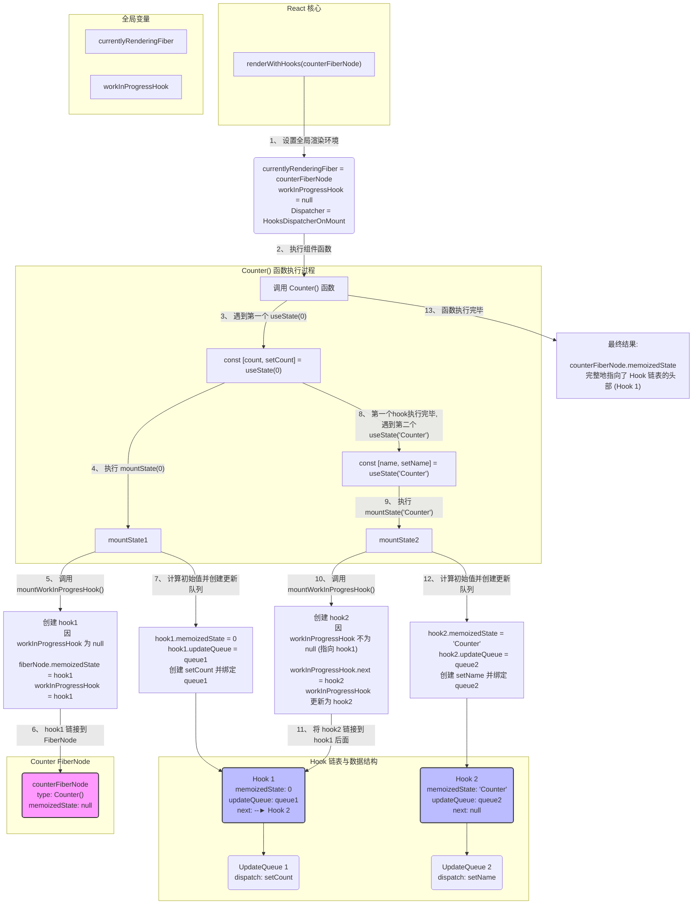

### jsx

```js
function Counter() {
	// 第一次调用 useState
	const [count, setCount] = useState(0);
	// 第二次调用 useState
	const [name, setName] = useState('Counter');

	// ... 返回 JSX
}
```

### 流程图



### 流程解释

1. **准备阶段 (`renderWithHooks`)**:

   - React 调用 `renderWithHooks(counterFiberNode)`。
   - `currentlyRenderingFiber` 被设置为 `counterFiberNode`。
   - 由于是首次挂载 (`wip.alternate` 为 `null`)，`currentDispatcher.current` 被设置为 `HooksDispatcherOnMount`。这意味着接下来在 `Counter` 组件内部调用的 `useState` 实际上会执行 `mountState` 函数。
   - React 开始执行 `Counter()` 函数。

2. **执行第一次 `useState(0)`**:

   - 调用 `mountState(0)`。
   - **`mountWorkInProgresHook()` 被调用**:
     - 创建一个新的 `Hook` 对象 (`hook1`)。
     - 此时 `workInProgressHook` 为 `null`（因为是第一个 Hook），所以 `counterFiberNode.memoizedState` 指向这个新的 `hook1`。
     - 全局的 `workInProgressHook` 也指向 `hook1`，为下一个 Hook 的链接做准备。
   - **计算初始值**: `hook1.memoizedState` 被设置为 `0`。
   - **创建更新队列**: `createUpdateQueue()` 创建一个与 `hook1` 关联的 `updateQueue`，并赋值给 `hook1.updateQueue`。
   - **创建 `dispatch` 函数**: 创建 `setCount` 函数，它内部已经通过 `.bind` 绑定了当前的 `counterFiberNode` 和 `hook1` 的 `updateQueue`。
   - `mountState` 返回 `[0, setCount]`。

3. **执行第二次 `useState('Counter')`**:

   - 调用 `mountState('Counter')`。
   - **`mountWorkInProgresHook()` 再次被调用**:
     - 创建第二个 `Hook` 对象 (`hook2`)。
     - 此时 `workInProgressHook` 不为 `null`（它正指向 `hook1`），所以执行 `else` 分支。
     - **关键一步：** `workInProgressHook.next = hook2`，也就是 `hook1.next = hook2`。**链表就这样形成了！**
     - 全局的 `workInProgressHook` 指针移动到 `hook2`，现在它成为链表的尾部。
   - **计算初始值**: `hook2.memoizedState` 被设置为 `'Counter'`。
   - **创建更新队列**: 为 `hook2` 创建一个全新的、独立的 `updateQueue`。
   - **创建 `dispatch` 函数**: 创建 `setName` 函数，绑定了 `counterFiberNode` 和 `hook2` 的 `updateQueue`。
   - `mountState` 返回 `['Counter', setName]`。

4. **收尾阶段 (`renderWithHooks`)**:

   - `Counter` 函数执行完毕。
   - `currentlyRenderingFiber` 被重置为 `null`。
   - 最终，`counterFiberNode` 的 `memoizedState` 属性牢牢地指向了 `Hook` 链表的头部 (`hook1`)，这个链表记录了组件所有状态的初始信息。
