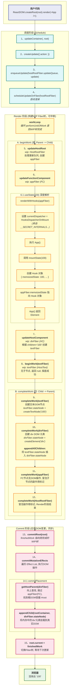

从执行ReactDOM.createRoot(root).render(<App />)
到浏览器渲染出“100”发生了什么

### 直观流程图

```mermaid
graph TD
    subgraph " "
        direction LR
        UserCode["<b>用户代码</b><br/>ReactDOM.createRoot(root).render(&lt;App /&gt);"]
    end

    subgraph "调度阶段 (Schedule)"
        direction TB
        A["1、updateContainer(<App/>, root)"]
        B["2、createUpdate({ action: <App/> })"]
        C["3、enqueueUpdate(hostRootFiber.updateQueue, update)"]
        D["4、 scheduleUpdateOnFiber(hostRootFiber)<br><i>启动渲染</i>"]
    end

    subgraph "Render 阶段 (构建WIP Fiber树，可中断)"
        WL["<b>workLoop</b><br><i>循环 performUnitOfWork 直到WIP树完成</i>"]

        subgraph "A. beginWork (递: Parent -> Child)"
            direction TB
            bw_root["5、<b>updateHostRoot</b><br><i>wip: HostRootFiber</i><br>处理更新队列, 创建 appFiber"]
            bw_fc["6、<b>updateFunctionComponent</b><br><i>wip: appFiber (FC)</i>"]
            bw_hc["7、<b>updateHostComponent</b><br><i>wip: divFiber (HC)</i><br>根据 children='100' 创建 textFiber"]
            bw_text["8、<b>beginWork(textFiber)</b><br><i>wip: textFiber (HostText)</i><br>无子节点, 返回 null, 探底成功"]

            subgraph "6.1 useState(100) 深度解析"
                bw_fc_rh["renderWithHooks(appFiber)"]
                bw_fc_disp["设置 currentDispatcher = HooksDispatcherOnMount<br><i>(来自 __SECRET_INTERNALS...)</i>"]
                bw_fc_call["执行 App()"]
                bw_fc_useState["调用 mountState(100)"]
                bw_fc_hook["创建 Hook 对象<br>{ memoizedState: 100, ... }"]
                bw_fc_link["appFiber.memoizedState 指向 Hook 对象"]
                bw_fc_return["App() 返回 <div> Element"]
            end

        end

        subgraph "B. completeWork (归: Child -> Parent)"
            direction TB
            cw_text["9、<b>completeWork(textFiber)</b><br>创建文本DOM节点<br><i>textFiber.stateNode = createTextNode('100')</i>"]
            cw_hc["10、<b>completeWork(divFiber)</b><br>创建 div DOM 元素<br><i>divFiber.stateNode = createElement('div')</i><br><br><b>appendAllChildren:</b><br>将 textFiber.stateNode 插入 divFiber.stateNode"]
            cw_fc["11、<b>completeWork(appFiber)</b><br>FC节点无DOM操作, 冒泡子节点的副作用标记"]
            cw_root["12、<b>completeWork(HostRootFiber)</b><br>冒泡副作用标记, Render阶段结束"]
        end
    end

    subgraph "Commit 阶段 (应用DOM变更，同步)"
        direction TB
        CR["13、<b>commitRoot(root)</b><br><i>finishedWork 指向刚完成的WIP树</i>"]
        CME["14、<b>commitMutationEffects</b><br>遍历 Effect List, 执行DOM操作"]

        subgraph "14.1 commitPlacement"
            getHostParent["<b>getHostParent(divFiber)</b><br>向上查找, 跳过 appFiber(FC),<br>找到根DOM容器 #root"]
            appendChild["<b>appendChild(rootContainer, divFiber.stateNode)</b><br>将内存中的'div'元素挂载到真实DOM"]
        end

        SWITCH["15、<b>root.current = finishedWork</b><br>切换Fiber树, 等待下次更新"]
    end

    subgraph " "
        direction LR
        Browser["<b>浏览器</b><br>渲染出 '100'"]
    end

    %% 流程连接
    UserCode --> A --> B --> C --> D --> WL

    WL --> bw_root

    bw_root --> bw_fc
    bw_fc --> bw_fc_rh --> bw_fc_disp --> bw_fc_call --> bw_fc_useState --> bw_fc_hook --> bw_fc_link --> bw_fc_return
    bw_fc_return --> bw_hc

    bw_hc --> bw_text
    bw_text --> cw_text
    cw_text --> cw_hc
    cw_hc --> cw_fc
    cw_fc --> cw_root
    cw_root --> CR

    CR --> CME
    CME --> getHostParent --> appendChild
    appendChild --> SWITCH
    SWITCH --> Browser

    %% 样式
    classDef schedule fill:#e0f7fa,stroke:#00796b,stroke-width:2px;
    classDef render fill:#fff9c4,stroke:#f57f17,stroke-width:2px;
    classDef commit fill:#fce4ec,stroke:#c2185b,stroke-width:2px;
    classDef user fill:#e8eaf6,stroke:#303f9f,stroke-width:2px;
    classDef final fill:#e8f5e9,stroke:#2e7d32,stroke-width:2px;

    class UserCode user;
    class A,B,C,D schedule;
    class WL,bw_root,bw_fc,bw_hc,bw_text,cw_text,cw_hc,cw_fc,cw_root,bw_fc_rh,bw_fc_disp,bw_fc_call,bw_fc_useState,bw_fc_hook,bw_fc_link,bw_fc_return render;
    class CR,CME,getHostParent,appendChild,SWITCH commit;
    class Browser final;
```
