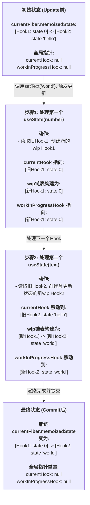

### 前提

```js
function MyComponent() {
	const [number, setNumber] = useState(0); // Hook 1
	const [text, setText] = useState('hello'); // Hook 2
}
```

- 假设它已经完成了首次渲染

初始状态 (Update 前):

current 树存在，其 Fiber 节点的 memoizedState 指向一个包含两个 Hook 对象的链表。现在，我们触发一次更新：调用 setText('world')。

### 直观的流程图



### 流程图解释

#### **A. 初始状态 (Update前)**

- `current` 树的 Fiber 节点上已经有一条由两次 `useState` 调用创建的 Hook 链表。
- 在开始处理 `MyComponent` 的更新渲染之前，两个全局指针 `currentHook` 和 `workInProgressHook` 都被重置为 `null`。

#### **B. 步骤1: 处理第一个 `useState(number)`**

- `updateWorkInProgresHook` 被调用。
- **读取**: 它从 `currentFiber.memoizedState` 拿到旧的 `Hook1`，并让 `currentHook` 指向它。
- **创建**: 基于 `currentHook` 的信息（状态为 `0`），创建一个新的 `wip Hook1`。
- **链接**: 因为这是 `wip` 链表的第一个 Hook，所以 `wipFiber.memoizedState` 和 `workInProgressHook` 都指向这个新创建的 `wip Hook1`。

#### **C. 步骤2: 处理第二个 `useState(text)`**

- `updateWorkInProgresHook` 再次被调用。
- **读取**: `currentHook` 指针向前移动，指向旧的 `Hook2` (`currentHook = currentHook.next`)。
- **创建**: 基于 `currentHook`（状态为 `'hello'`）和 `setText('world')` 这个更新，创建一个新的 `wip Hook2`，其状态被计算为 `'world'`。
- **链接**: `workInProgressHook` 指针将这个新的 `wip Hook2` 连接到 `wip Hook1` 的后面，然后自身也移动到链表的末尾，指向 `wip Hook2`。

#### **D. 最终状态 (Commit后)**

- 组件渲染完成，包含新状态的 `wip` 树在“提交”阶段成为了新的 `current` 树。
- 我们刚刚构建的 `wip` Hooks 链表现在成为了新的 `current` Hooks 链表，持久化了这次更新的结果。
- 两个全局指针再次被重置为 `null`，为下一次可能的更新做好准备。
