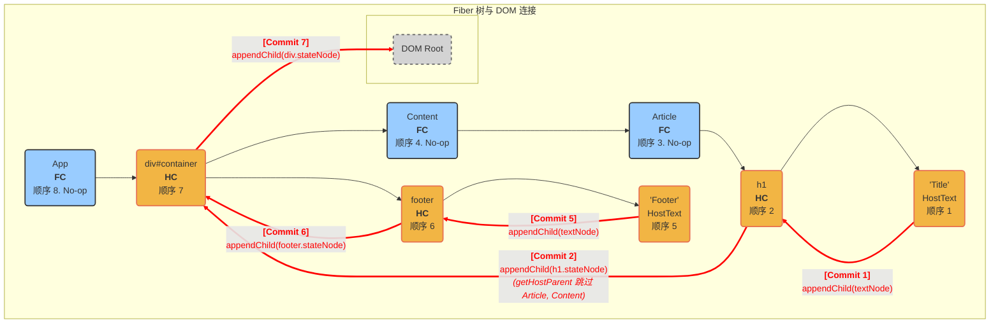

### 场景介绍

- **父: FC, 子: FC**: `Content` 组件渲染 `Article` 组件。
- **父: FC, 子: HC**: `Article` 组件渲染 `<h1>` 标签。
- **父: HC, 子: FC**: `<div>` 标签渲染 `Content` 组件。
- **父: HC, 子: HC**: `<div>` 标签渲染 `<footer>` 标签。

```js
// 1. App (FC)
function App() {
	return (
		// 4. div (HC), a parent for both FC and HC
		<div id="container">
			<Content /> {/* 5. Content (FC) */}
			<footer>Footer</footer> {/* 6. footer (HC) */}
		</div>
	);
}

// 2. Content (FC), a parent for an FC
function Content() {
	// 3. Article (FC), a child of an FC
	return <Article />;
}

// 4. Article (FC), a parent for an HC
function Article() {
	// 5. h1 (HC), a child of an FC
	return <h1>Title</h1>;
}
```

### 遍历与 DOM 构建图 (Mermaid)

下图详细描绘了根据上述组件生成的 Fiber 树，以及在 `commitMutationEffects` 阶段，真实 DOM 是如何被一步步构建起来的。

- **节点**：代表 Fiber 节点，标明了类型（FC/HC）、提交顺序和操作。蓝色为函数组件，橙色为宿主组件/文本。
- **细黑线**：代表 Fiber 树中的父子/兄弟关系。
- **粗红线**：代表**真实的 DOM 操作**，展示了 `appendChild` 的过程，清晰地体现了 DOM 节点是如何被挂载的。



### 关键步骤分解

1. **从叶子节点开始 (顺序 1, 2)**：

   - 遍历深入到最左侧的叶子节点 `'Title'` (HostText)。
   - **Commit 1**: 将 `'Title'` 的文本节点附加到其父 Fiber `h1` 对应的 DOM 节点上。
   - **Commit 2**: 处理 `h1`。为了找到 `<h1>` 要挂载到哪，`getHostParent` 会从 `h1` 开始向上查找，它会**跳过** `Article(FC)` 和 `Content(FC)`，因为它们没有对应的 DOM 节点，最终找到 `div` 作为父级 DOM 节点。于是，`<h1>` 被附加到 `<div>`。

2. **向上并转向兄弟节点 (顺序 3, 4, 5, 6)**：

   - `Article` 和 `Content` 是函数组件，它们自身没有 `Placement` 副作用，因此遍历经过它们时是无操作（No-op）的。
   - 遍历从 `Content` 返回到 `div` 后，转向 `div` 的兄弟节点路径，处理 `footer`。
   - **Commit 5 & 6**: 类似地，先处理 `'Footer'` 文本节点，再将 `<footer>` DOM 节点附加到其父级 DOM 节点 `<div>` 上。

3. **处理父容器 (顺序 7)**：

   - 当 `div` 的所有子孙节点的副作用都处理完毕后，最后处理 `div` 自身。
   - **Commit 7**: 将 `<div>` 附加到最终的 `RootContainer` 上。

4. **收尾 (顺序 8)**：

   - 最后遍历到根部的 `App(FC)`，它同样是无操作的，之后整个流程结束。
