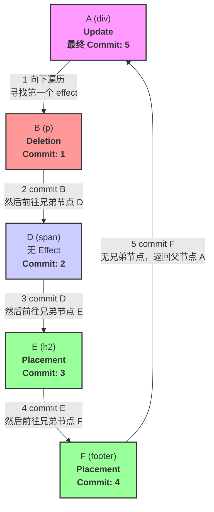

## 1 状态的说明

**初始状态**

```html
<div id="A">
	<p id="B">旧内容</p>
	<span id="D">不变</span>
</div>
```

**更新内容**

1. div#A 的 className 改变了。
2. p#B 被删除了。
3. span#D 没有任何变化。
4. 在 span#D 之后，新增了一个 h2#E
5. 在 div#A 的末尾，新增了一个 footer#F。

**更新后的状态**

```html
<div id="A" class="updated">
	<span id="D">不变</span>
	<h2 id="E">新增标题</h2>
	<footer id="F">新增页脚</footer>
</div>
```

## 2 render后的fiber

#### flags

- A (div): 有 Update 标记。其子树中有删除和新增，所以 subtreeFlags 会包含 Deletion 和 Placement。
- B (p): 有 Deletion 标记。
- D (span): 无标记。
- E (h2): 有 Placement 标记 (新增)。
- F (footer): 有 Placement 标记 (新增)。

#### 结构

- A (Update)
  - B (Deletion)
  - D (无)
  - E (Placement)
  - F (Placement)

## 3 commitWork的流程

==本质是dfs的后序遍历==
一个节点（如 A）的 DOM 操作（Update）总是在其所有子节点的操作（Deletion, Placement）全部完成之后才执行

#### 流程文字版

`commitMutationEffects` 从根节点 `A` 开始执行，`nextEffect` 指针初始指向 `A`。

1. **当前节点: `A`**

   - **向下遍历**: `A` 的 `subtreeFlags` 包含 `Deletion` 和 `Placement`，且 `A` 有子节点 `B`。因此，`nextEffect` 指针移动到 `B`。

2. **当前节点: `B`**

   - **向下遍历**: `B` 没有子节点。
   - **向上遍历**:
     - **执行 `commitMutaitonEffectsOnFiber(B)`**。`B` 被从 DOM 中删除。 **(处理顺序: 1)**
     - 查找 `B` 的兄弟节点 `D`。
     - `nextEffect` 指针移动到 `D`，跳出向上遍历的 `up` 循环。

3. **当前节点: `D`**

   - **向下遍历**: `D` 没有子节点且自身没有 effect flags。
   - **向上遍历**:
     - **执行 `commitMutaitonEffectsOnFiber(D)`**。由于 `D` 无 `flags`，此操作为空。 **(处理顺序: 2)**
     - 查找 `D` 的兄弟节点 `E`。
     - `nextEffect` 指针移动到 `E`，跳出 `up` 循环。

4. **当前节点: `E`**

   - **向下遍历**: `E` 没有子节点。
   - **向上遍历**:
     - **执行 `commitMutaitonEffectsOnFiber(E)`**。`E` 被插入到 DOM 中。 **(处理顺序: 3)**
     - 查找 `E` 的兄弟节点 `F`。
     - `nextEffect` 指针移动到 `F`，跳出 `up` 循环。

5. **当前节点: `F`**

   - **向下遍历**: `F` 没有子节点。
   - **向上遍历**:
     - **执行 `commitMutaitonEffectsOnFiber(F)`**。`F` 被插入到 DOM 中。 **(处理顺序: 4)**
     - `F` 没有兄弟节点，`nextEffect` 移动到其父节点 `A`。

6. **当前节点: `A` (从向上遍历返回)**

   - **继续向上遍历**:
     - **执行 `commitMutaitonEffectsOnFiber(A)`**。`A` 的 `className` 被更新。 **(处理顺序: 5)**
     - `A` 没有兄弟节点，`nextEffect` 移动到其父节点（此处为 `null`，因为 `A` 是 `finishedWork` 的根）。

7. **`nextEffect` 为 `null`**，`while` 循环结束。

#### 流程图


