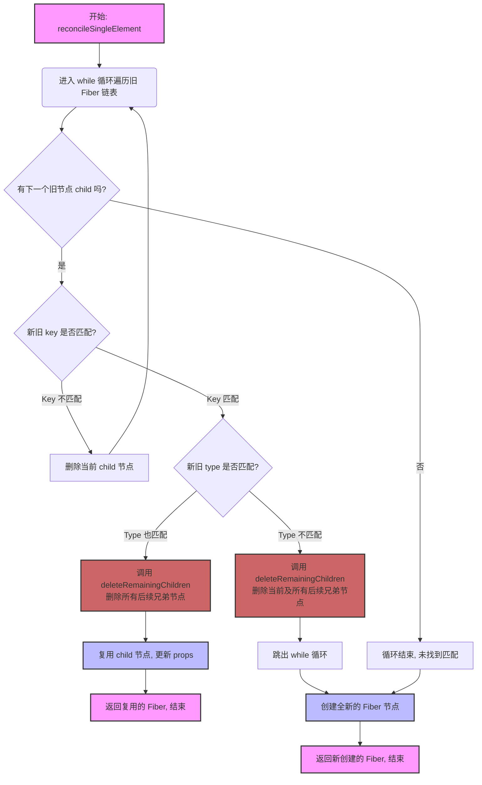

# 单节点 diff

### reconcileSingleElement

reconcileSingleElement 的「单节点」意味着「更新后是单节点」

- ABC -> A
- A1 -> B1
- A1 -> A2

我们需要区分4种情况：

key相同，type相同 == 复用当前节点, 将兄弟节点打上删除标签, 结束循环
例如：A1 B2 C3 -> A1

key相同，type不同 == 不存在任何复用的可能性, 创建新节点, 将兄弟节点打上删除标签,结束循环
例如：A1 B2 C3 -> B1

key不同，type相同 == 当前节点不能复用, 找兄弟节点试试
key不同，type不同 == 当前节点不能复用, 找兄弟节点试试

#### 流程图



#### 流程图解释

在 `reconcileSingleElement` 函数内部，逻辑是这样的：

1. **开始循环**：从 `currentFirstChild` 开始，遍历旧的 Fiber 子节点链表。
2. **寻找匹配**：在循环中，拿新元素的 `key` 和当前遍历到的旧 Fiber 节点 `child` 的 `key` 进行比较。

   - **情况一：Key 不匹配** (`child.key !== newElement.key`)
     - 说明当前这个 `child` 肯定不是要找的节点。
     - 调用 `deleteChild(child)`，将这个 `child` 单独标记为删除。
     - 循环继续，检查下一个兄弟节点 `child.sibling`。
   - **情况二：Key 匹配** (`child.key === newElement.key`)
     - 找到了 `key` 相同的节点，这是潜在的复用目标！接下来检查 `type`。
     - **如果 Type 也匹配** (e.g.,都是 `div`)：
       - **完美匹配！** 决定复用这个 `child` 节点。
       - **立刻调用 `deleteRemainingChildren(returnFiber, child.sibling)`**。这正是您指出的关键点：它直接把当前匹配节点的 **所有弟弟**（`child.sibling` 以及之后的所有节点）一次性全部标记为删除。
       - 复用 `child` 节点，更新它的 props，然后函数返回，整个协调过程结束。
     - **如果 Type 不匹配** (e.g., 一个是 `div`，一个是 `span`)：
       - 虽然 `key` 相同，但 `type` 不同，React 认为这棵树不能再往下复用了。
       - **调用 `deleteRemainingChildren(returnFiber, child)`**。注意，这次是从 `child` **自身** 开始，把包括它在内的所有后续兄弟节点都标记为删除。
       - 跳出循环，因为已经没必要再往后找了。

3. **循环结束**：

   - 如果循环正常结束（意味着遍历完了所有旧节点都没找到 `key` 匹配的），说明这是一个全新的节点，直接创建新 Fiber。
   - 如果循环是因 `break` 跳出的（`key` 匹配但 `type` 不匹配），同样也需要创建新 Fiber。

### reconcileSingleTextNode

type 相同:

- 复用
- deleteRemainingChildren
  type 不同:
- 打上删除标记
- 去兄弟节点找找机会

# 多节点 diff

整体流程分为4步：

1. 将current中所有同级fiber保存在Map中

2. 遍历newChild数组，对于每个遍历到的element，存在两种情况：

   - 在Map中存在对应current fiber，且可以复用
   - 在Map中不存在对应current fiber，或不能复用

3. 判断是插入还是移动

- 视角放到旧链表
- lastPlacedIndex < oldFiber[newElement].index: 不标记 Placement
  否则，标记 Placement

4. 最后Map中剩下的都标记删除

## reconcileChildrenArray

在 reconcileChildrenArray 中，参数 currentFirstChild 是 returnFiber.alternate 的=第一个子节点

### 一个直观的例子

```js
// 旧的 JSX
[
	<div key="A">A</div>, // oldIndex = 0
	<div key="B">B</div>, // oldIndex = 1
	<div key="C">C</div> // oldIndex = 2
];
```

```js
// 新的 JSX
[
	<div key="C">C</div>, // newIndex = 0
	<div key="A">A</div>, // newIndex = 1
	<div key="D">D</div> // newIndex = 2
];
```

firstNewFiber: 新链表的“头指针”。它将永远指向最终生成的新子节点链表的第一个节点。

lastNewFiber: 新链表的“尾指针”。它总是指向我们刚刚处理完的、新链表中的最后一个节点，方便我们把下一个新节点接在它后面。

lastPlacedIndex: “上次安放位置”的记录员。它记录了在旧列表中，最后一个可被复用且不需要移动的节点的位置。这是决定一个节点是否需要移动的关键。

### 流程图

```mermaid
graph TD
    subgraph "初始状态 (Initial State)"
        direction LR
        Old["<b>旧列表 (Old List)</b><br/>[ A (idx=0), B (idx=1), C (idx=2) ]"] --- New["<b>新列表 (New List)</b><br/>[ C, A, D ]"]
        New --- Vars0["<b>初始变量</b><br/>lastPlacedIndex = 0<br/>firstNewFiber = null<br/>lastNewFiber = null"]
    end

    Start("开始遍历新列表") --> Step1

    subgraph "第 1 步: 处理新列表的 'C' (newIndex = 0)"
        FindC["1、 在旧列表中找到 C<br/>它的 oldIndex = 2"]
        CompareC["2、 比较: oldIndex (2) > lastPlacedIndex (0)"]
        DecisionC["3、 <b>决策: 复用 C, 不移动</b><br/>因为它的旧位置在标尺之后"]
        UpdateC["4、 <b>更新变量:</b><br/>lastPlacedIndex = 2 (更新为 C 的旧位置)<br/>firstNewFiber, lastNewFiber 都指向 C<br/>新链表: <b>C</b>"]

        FindC --> CompareC --> DecisionC --> UpdateC
    end

    Start --> Step1

    subgraph "第 2 步: 处理新列表的 'A' (newIndex = 1)"
        FindA["1、 在旧列表中找到 A<br/>它的 oldIndex = 0"]
        CompareA["2、 比较: oldIndex (0) < lastPlacedIndex (2)"]
        DecisionA["3、 <b>决策: 复用 A, 但需移动 (标记 Placement)</b><br/>因为它的旧位置在标尺之前"]
        UpdateA["4、 <b>更新变量:</b><br/>lastPlacedIndex = 2 (不变, 因为 A 不稳定)<br/>lastNewFiber 指向 A<br/>新链表: <b>C -> A</b>"]

        FindA --> CompareA --> DecisionA --> UpdateA
    end

    Step1 --> Step2

    subgraph "第 3 步: 处理新列表的 'D' (newIndex = 2)"
        FindD["1、 在旧列表中找不到 D"]
        DecisionD["2、 <b>决策: 创建新节点 D (标记 Placement)</b>"]
        UpdateD["3、 <b>更新变量:</b><br/>lastPlacedIndex = 2 (不变)<br/>lastNewFiber 指向 D<br/>新链表: <b>C -> A -> D</b>"]

        FindD --> DecisionD --> UpdateD
    end

    Step2 --> Step3

    subgraph "最终结果 (Final Result)"
        FinalChain["<b>新 Fiber 链表构建完成</b><br/>firstNewFiber 指向 C<br/>C.sibling -> A.sibling -> D"]
        DOMOps["<b>生成的 DOM 操作</b><br/>- C: 位置不变<br/>- B: 删除 (循环结束后单独处理)<br/>- A: 移动到 C 之后<br/>- D: 创建并插入到 A 之后"]
    end

    Step3 --> FinalChain --> DOMOps

    style Start fill:#f9f,stroke:#333,stroke-width:2px
    style DecisionC fill:#b2f,stroke:#333,stroke-width:2px
    style DecisionA fill:#f61,stroke:#333,stroke-width:2px
    style DecisionD fill:#f66,stroke:#333,stroke-width:2px
```



### 流程图的解释

`lastPlacedIndex` 初始值为 `0`。`firstNewFiber` 和 `lastNewFiber` 都是 `null`。

#### 第 1 步：处理新列表的 `C` (`newIndex = 0`)

1. **寻找旧节点**：React 在旧列表中找到了 `key="C"` 的节点，它在旧列表中的位置是 `oldIndex = 2`。
2. **比较 `oldIndex` 和 `lastPlacedIndex`**：

   - `oldIndex` (2) > `lastPlacedIndex` (0)。
   - **解读**：这说明 `C` 在旧列表中的位置比我们上次安放的位置要靠后。这意味着 `C` 是“向前移动”的（或者相对位置没变），所以它**不需要移动** DOM。

3. **更新变量**:

   - **`lastPlacedIndex`**: 更新为 `C` 的旧位置，即 `2`。
   - **`firstNewFiber`**: 这是新链表的第一个节点，所以指向 `C` 的 Fiber。
   - **`lastNewFiber`**: 也指向 `C` 的 Fiber。

**当前状态**:

- `lastPlacedIndex`: **2**
- 新 Fiber 链表: `C` (`firstNewFiber` 和 `lastNewFiber` 都指向它)
- DOM 操作: `C` 不需要移动。

---

#### 第 2 步：处理新列表的 `A` (`newIndex = 1`)

1. **寻找旧节点**：React 在旧列表中找到了 `key="A"` 的节点，它在旧列表中的位置是 `oldIndex = 0`。
2. **比较 `oldIndex` 和 `lastPlacedIndex`**：

   - `oldIndex` (0) < `lastPlacedIndex` (2)。
   - **解读**：**关键点来了！** 这说明 `A` 在旧列表中的位置，比我们刚才安放的 `C` 的旧位置还要靠前。这意味着，如果我们想让 `A` 排在 `C` 的后面，就**必须移动 `A` 的 DOM 节点**。React 会复用 `A` 的 Fiber，但会给它打上一个 `Placement` 的标记。

3. **更新变量**:

   - **`lastPlacedIndex`**: **不更新！** 因为 `A` 节点需要移动，它不是一个稳定的“锚点”，所以我们不更新这个值。
   - **`firstNewFiber`**: 保持不变，仍然是 `C`。
   - **`lastNewFiber`**: 把 `A` 接在 `C` 的后面，所以 `lastNewFiber` 现在指向 `A`。

**当前状态**:

- `lastPlacedIndex`: **2**
- 新 Fiber 链表: `C -> A` (`firstNewFiber` 指向 `C`, `lastNewFiber` 指向 `A`)
- DOM 操作: `A` 需要移动 (标记 `Placement`)。

---

#### 第 3 步：处理新列表的 `D` (`newIndex = 2`)

1. **寻找旧节点**：React 在旧列表中**找不到** `key="D"` 的节点。
2. **解读**：这是一个全新的节点。React 需要为它**创建**一个新的 Fiber，并打上 `Placement` 标记，因为新节点总是需要被插入到 DOM 中。
3. **更新变量**:

   - **`lastPlacedIndex`**: 不变，因为这是新节点，跟旧位置无关。
   - **`firstNewFiber`**: 保持不变，仍然是 `C`。
   - **`lastNewFiber`**: 把 `D` 接在 `A` 的后面，所以 `lastNewFiber` 现在指向 `D`。

**当前状态**:

- `lastPlacedIndex`: **2**
- 新 Fiber 链表: `C -> A -> D` (`firstNewFiber` 指向 `C`, `lastNewFiber` 指向 `D`)
- DOM 操作: `D` 需要创建并插入 (标记 `Placement`)。
