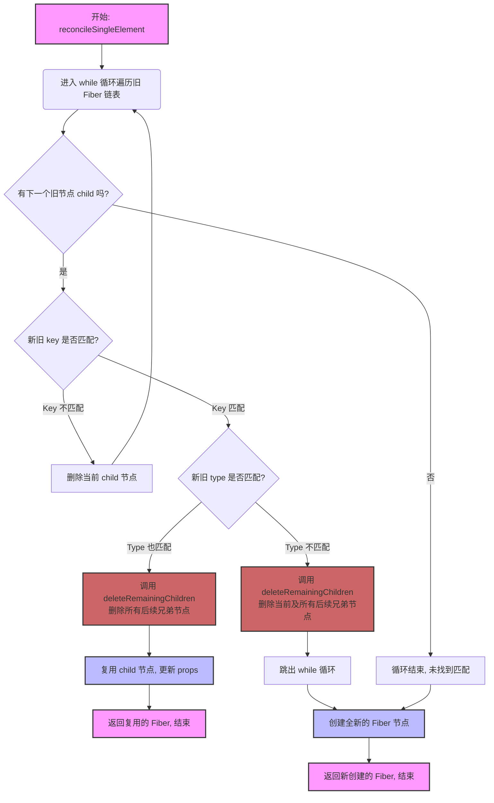

git
单节点diff: reconcileSingleElement,

### reconcileSingleElement

reconcileSingleElement 的「单节点」意味着「更新后是单节点」

- ABC -> A
- A1 -> B1
- A1 -> A2

我们需要区分4种情况：

key相同，type相同 == 复用当前节点, 将兄弟节点打上删除标签, 结束循环
例如：A1 B2 C3 -> A1

key相同，type不同 == 不存在任何复用的可能性, 创建新节点, 将兄弟节点打上删除标签,结束循环
例如：A1 B2 C3 -> B1

key不同，type相同 == 当前节点不能复用, 找兄弟节点试试
key不同，type不同 == 当前节点不能复用, 找兄弟节点试试

#### 流程图

#### 流程图解释

在 `reconcileSingleElement` 函数内部，逻辑是这样的：

1. **开始循环**：从 `currentFirstChild` 开始，遍历旧的 Fiber 子节点链表。
2. **寻找匹配**：在循环中，拿新元素的 `key` 和当前遍历到的旧 Fiber 节点 `child` 的 `key` 进行比较。

   - **情况一：Key 不匹配** (`child.key !== newElement.key`)
     - 说明当前这个 `child` 肯定不是要找的节点。
     - 调用 `deleteChild(child)`，将这个 `child` 单独标记为删除。
     - 循环继续，检查下一个兄弟节点 `child.sibling`。
   - **情况二：Key 匹配** (`child.key === newElement.key`)
     - 找到了 `key` 相同的节点，这是潜在的复用目标！接下来检查 `type`。
     - **如果 Type 也匹配** (e.g.,都是 `div`)：
       - **完美匹配！** 决定复用这个 `child` 节点。
       - **立刻调用 `deleteRemainingChildren(returnFiber, child.sibling)`**。这正是您指出的关键点：它直接把当前匹配节点的 **所有弟弟**（`child.sibling` 以及之后的所有节点）一次性全部标记为删除。
       - 复用 `child` 节点，更新它的 props，然后函数返回，整个协调过程结束。
     - **如果 Type 不匹配** (e.g., 一个是 `div`，一个是 `span`)：
       - 虽然 `key` 相同，但 `type` 不同，React 认为这棵树不能再往下复用了。
       - **调用 `deleteRemainingChildren(returnFiber, child)`**。注意，这次是从 `child` **自身** 开始，把包括它在内的所有后续兄弟节点都标记为删除。
       - 跳出循环，因为已经没必要再往后找了。

3. **循环结束**：

   - 如果循环正常结束（意味着遍历完了所有旧节点都没找到 `key` 匹配的），说明这是一个全新的节点，直接创建新 Fiber。
   - 如果循环是因 `break` 跳出的（`key` 匹配但 `type` 不匹配），同样也需要创建新 Fiber。

### reconcileSingleTextNode

type 相同:

- 复用
- deleteRemainingChildren
  type 不同:
- 打上删除标记
- 去兄弟节点找找机会
