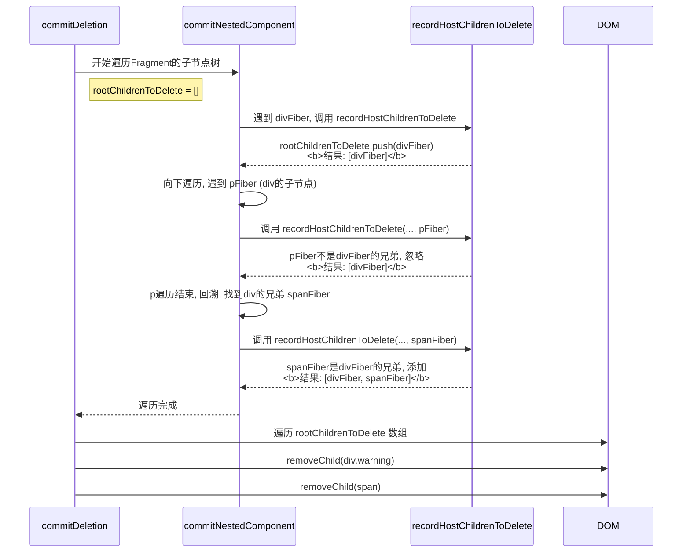

## 例子

假设我们有如下的组件结构，`ParentComponent` 将被卸载。它内部的 `DynamicWrapper` 根据 `showWarning` prop 决定是否渲染一个 `div` 包裹的警告信息，同时还有一个静态的 `<footer>`。

```js
// 即将被卸-载的组件
function ParentComponent() {
	return (
		<div className="container">
			<DynamicWrapper showWarning={true} />
			<footer>这是页脚</footer>
		</div>
	);
}

// 中间层组件
function DynamicWrapper({ showWarning }) {
	const content = (
		// 使用Fragment返回多个并列元素
		<>
			{showWarning && (
				<div className="warning">
					<p>警告信息！</p>
				</div>
			)}
			<span>一些内容</span>
		</>
	);
	return content;
}
```

当 `ParentComponent` 卸载时，React需要移除它渲染出的所有DOM节点。我们关注的焦点是 `DynamicWrapper` 返回的这部分DOM结构，以及它是如何被清理的。

最终渲染的DOM结构会是这样：

```html
<div class="container">
	<div class="warning">
		<p>警告信息！</p>
	</div>
	<span>一些内容</span>
	<footer>这是页脚</footer>
</div>
```

### 流程图



### 流程图的解释

当 `ParentComponent` 的父组件决定卸载它时，`commitDeletion` 会被调用来处理代表 `<ParentComponent />` 的Fiber节点。这会触发一个递归的清理过程。我们直接跳到对 `DynamicWrapper` 内容的处理，因为这是 `recordHostChildrenToDelete` 发挥关键作用的地方。

1. **开始卸载 `DynamicWrapper` 的内容**：React会遍历到代表 `DynamicWrapper` 内容的Fragment。
2. **初始化**：在处理这个Fragment的删除逻辑时，一个空数组被创建：`const rootChildrenToDelete = [];`
3. **深度优先遍历**：`commitNestedComponent` 开始遍历Fragment的子节点。

   - **遇到 `<div class="warning">`**：
     - 这是一个 `HostComponent`。
     - 调用 `recordHostChildrenToDelete(rootChildrenToDelete, divFiber)`。
     - 此时 `rootChildrenToDelete` 是 `[]` (空的)。
     - `divFiber` 被加入数组。
     - **`rootChildrenToDelete` 变为 `[divFiber]`。**
   - **深入 `div`，遇到 `<p>警告信息！</p>`**：
     - 这是一个 `HostComponent`。
     - 调用 `recordHostChildrenToDelete(rootChildrenToDelete, pFiber)`。
     - 此时 `rootChildrenToDelete` 是 `[divFiber]`。
     - 函数检查 `pFiber` 是否是数组最后一个元素（`divFiber`）的**兄弟**。
     - `pFiber` 是 `divFiber` 的**子节点**，不是兄弟。
     - 因此，`pFiber` **不会**被加入数组。
     - **`rootChildrenToDelete` 仍然是 `[divFiber]`。** (这是关键点!)
   - **`p` 遍历结束，回溯到 `div`，再回溯到Fragment，找到 `div` 的兄弟节点 `<span>`**：
     - 这是一个 `HostComponent`。
     - 调用 `recordHostChildrenToDelete(rootChildrenToDelete, spanFiber)`。
     - 此时 `rootChildrenToDelete` 是 `[divFiber]`。
     - 函数检查 `spanFiber` 是否是数组最后一个元素（`divFiber`）的**兄弟**。
     - `spanFiber` 确实是 `divFiber` 的兄弟节点。
     - `spanFiber` 被加入数组。
     - **`rootChildrenToDelete` 变为 `[divFiber, spanFiber]`。**

4. **最终操作**：

   - `commitNestedComponent` 遍历完成。
   - `commitDeletion` 拿到了最终的 `rootChildrenToDelete` 数组：`[divFiber, spanFiber]`。
   - React会遍历这个数组，并从它们的父DOM节点（在这里是`<div class="container">`）中依次移除它们：
     - 移除 `div.warning` 元素 (它的子元素 `p` 会被浏览器自动一并移除)。
     - 移除 `span` 元素。
