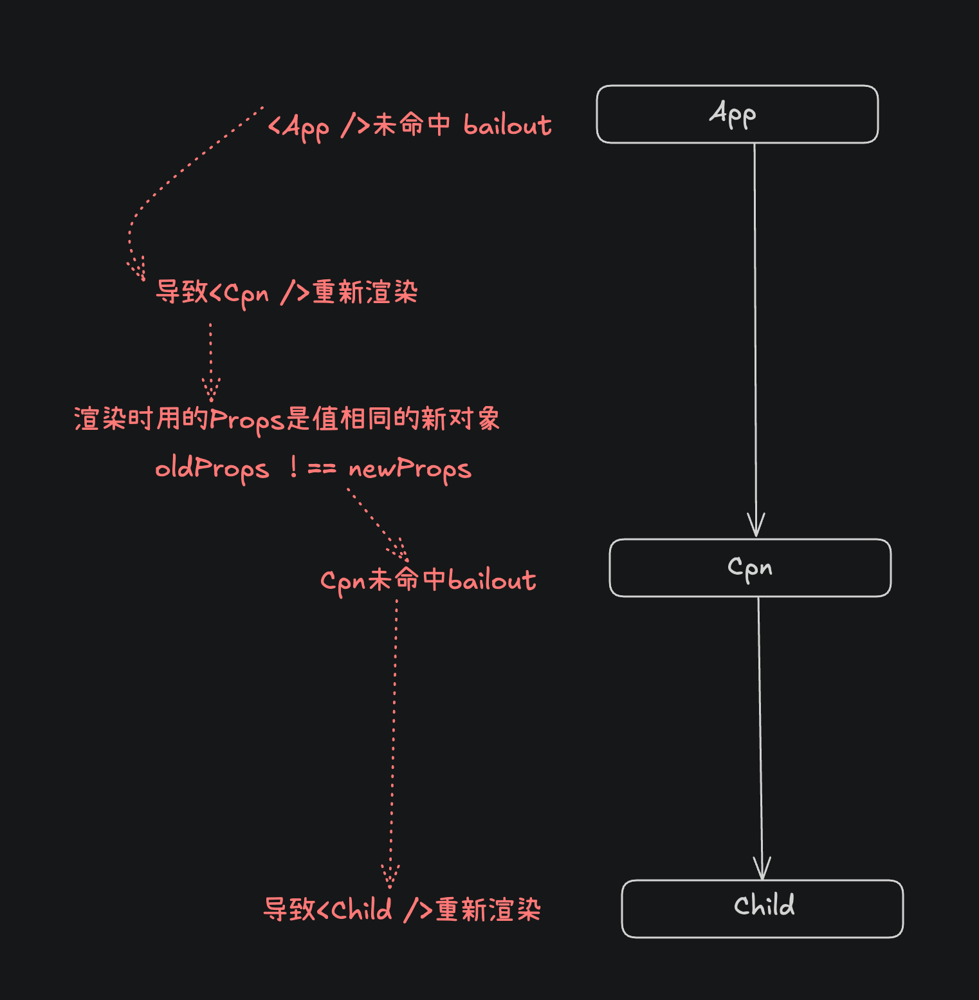

## 未进行 memo

理想中，`<Cpn num={0} name={'cpn2'} />` 中的 `<Child />` 不应该进行重复渲染，`<Cpn num={0} name={'cpn2'} />`的四要素没有变，按照 bailout 策略， 子组件clone

由于 <App /> 的 state 发生改变，`<Cpn num={0} name={'cpn2'} />` 是重新渲染生成的
这导致，Cpn 接受的 newProps = { num={0} name={'cpn2'} } 是全新的对象，引用的地址和 oldProps 不同

```jsx
import { useState, memo } from 'react';

export default function App() {
	const [num, update] = useState(0);
	console.log('App render ', num);
	return (
		<div onClick={() => update(num + 1)}>
			<Cpn num={num} name={'cpn1'} />
			<Cpn num={0} name={'cpn2'} />  // <-----这里
		</div>
	);
}

function Cpn({ num, name }) {
	console.log('render ', name);
	return (
		<div>
			{name}: {num}
			<Child />
		</div>
	);
}

function Child() {
	console.log('Child render');
	return <p>i am child</p>;
}
```

### 流程图


