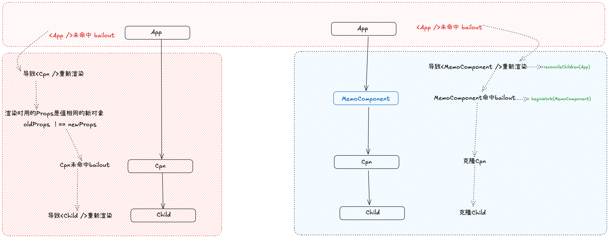

# memo

### 现有的问题

`A -> B -> C`

> 如果父组件 `A` 的 `state` 发生变化，`A` 会重新执行 `render` 函数。在 `render` 函数中，通过 JSX `<B name="cpn" />` 创建的 `props` 对象，**每一次都是一个全新的对象**，即使里面的 `name` 属性值没变。因此，当 React 去 `reconcile`（协调） `B` 组件时，进行 `oldProps !== newProps` 比较，结果永远是 `false`，导致 `B` 无法 Bailout，然后 `C` 也无法 Bailout……

### 目的是什么？

避免组件重复渲染：四要素 Props 的值相同，引用的对象不同

### 实现思路



添加一层 `<MemoComponent />` （常规中的父组件）

在 `updateMemoComponent` （常规中的 beginWork）中进行一次 bailout 检测，让四要素中的 `Props` 从全等比较变为==浅比较==

### 使用方法

```jsx
export default function App() {
	const [num, update] = useState(0);
	console.log('App render ', num);
	return (
		<div onClick={() => update(num + 1)}>
			<Cpn num={num} name={'cpn1'} />
			<Cpn num={0} name={'cpn2'} />
		</div>
	);
}

const Cpn = memo(function ({ num, name }) {
	console.log('render ', name);
	return (
		<div>
			{name}: {num}
			<Child />
		</div>
	);
});
```

### 静态：数据结构

REACT_MEMO_TYPE

`fiber.type = { $$typeof: REACT_MEMO_TYPE, type: Component, ... }`

### 函数的实现

react.memo

### 流程

#### 生产

fiber.type.$$typeof: REACT_MEMO_TYPE 的组件


