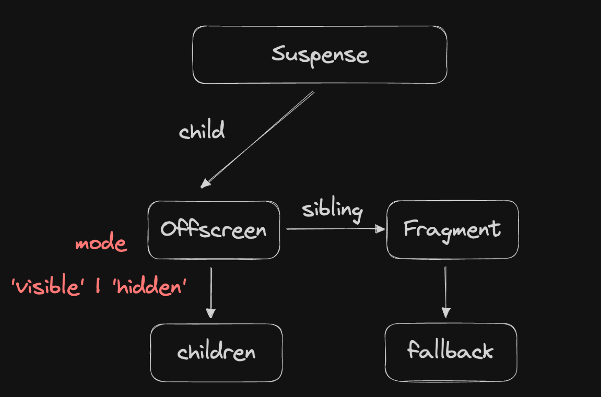

假设我们有这样一个 React 组件：

```jsx
<Suspense fallback={<p>Loading...</p>}>
	<MyLazyComponent />
</Suspense>
```

`updateSuspenseComponent` 函数的核心任务就是根据 `MyLazyComponent` 是否已经加载完成，来决定是渲染 `<MyLazyComponent />` 还是 `<p>Loading...</p>`。



---

### 场景一：正常状态 (未挂起)

在这种情况下，`MyLazyComponent` 的代码已经加载完毕，可以正常渲染。当 React 处理到这个 `<Suspense>` 组件时，它的 `wip` FiberNode 大致会是这样：

```javascript
// A simplified representation of the wip FiberNode for <Suspense>
const wipSuspenseNode_Normal = {
    tag: SuspenseComponent, // 标记这是一个 SuspenseComponent
    flags: NoFlags, // 没有 DidCapture 标志，因为没有挂起
    pendingProps: {
        children: <MyLazyComponent />,
        fallback: <p>Loading...</p>
    },
    alternate: { ... }, // 指向旧的 FiberNode

    // 重点看 child
    // updateSuspenseComponent 会创建一个 OffscreenComponent 来包裹主内容
    child: {
        tag: OffscreenComponent, //
        pendingProps: {
            mode: 'visible', // mode 是 'visible'，表示内容可见
            children: <MyLazyComponent />
        },
        return: wipSuspenseNode_Normal, // 指回父节点
        sibling: null, // 没有兄弟节点，因为只渲染主内容
        // ... 其他 OffscreenComponent 的属性
    }
    // ... 其他 SuspenseComponent 的属性
};
```

**与 `updateSuspenseComponent` 的联系**：

- 函数开始时，它检查 `(wip.flags & DidCapture) !== NoFlags`。在这个例子中，结果是 `false`。
- 因为没有挂起，它会走正常渲染的逻辑，调用 `mountSuspensePrimaryChildren` 或 `updateSuspensePrimaryChildren`。
- 这些函数的核心作用就是创建上面 `child` 字段所示的 `OffscreenComponent`，其 `mode` 设置为 `'visible'`。

---

### 场景二：挂起状态 (Suspended)

在这种情况下，`MyLazyComponent` 还在加载中，它抛出了一个 Promise。这个异常被 React 捕获，并为 `<Suspense>` 组件的 `wip` FiberNode 打上标记。

```javascript
// A simplified representation of the wip FiberNode for <Suspense> when suspended
const wipSuspenseNode_Suspended = {
    tag: SuspenseComponent,
    // 重点看 flags
    // 标记它捕获到了一个挂起事件
    flags: DidCapture, //
    pendingProps: {
        children: <MyLazyComponent />,
        fallback: <p>Loading...</p>
    },
    alternate: { ... },

    // 重点看 child 结构
    // updateSuspenseComponent 会创建两个子节点
    child: {
        tag: OffscreenComponent,
        pendingProps: {
            mode: 'hidden', // mode 是 'hidden'，主内容被隐藏但状态保留
            children: <MyLazyComponent />
        },
        return: wipSuspenseNode_Suspended,
        // 重点：它有一个兄弟节点，即 fallback
        sibling: {
            tag: HostComponent, // 这里是 fallback 的 FiberNode，比如 <p>
            type: 'p',
            pendingProps: { children: 'Loading...' },
            flags: Placement, // 标记这个 fallback 需要被插入到 DOM 中
            return: wipSuspenseNode_Suspended,
            sibling: null,
            // ...
        },
        // ...
    }
    // ...
};
```

**与 `updateSuspenseComponent` 的联系**：

- 函数开始时，检查 `(wip.flags & DidCapture) !== NoFlags`。在这个例子中，结果是 `true`。
- 因为捕获到了挂起，`showFallback` 变量被设为 `true`。
- 接着，函数会走挂起逻辑，调用 `mountSuspenseFallbackChildren` 或 `updateSuspenseFallbackChildren`。
- 这些函数会创建上述例子中的**两个**子节点：
  1.  一个 `mode` 为 `'hidden'` 的 `OffscreenComponent` 来包裹主内容。
  2.  一个正常的 FiberNode 来渲染 `fallback` 内容，并给它打上 `Placement` 标记，以便在 commit 阶段将它插入到 DOM 中。
