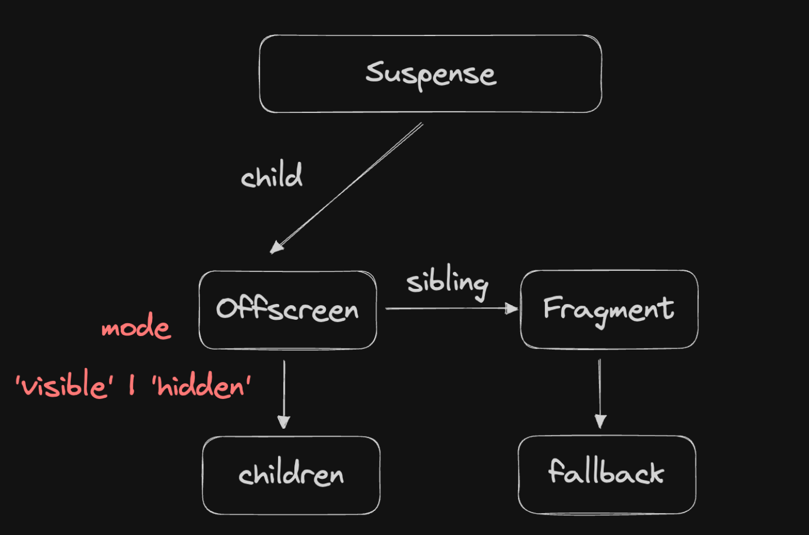
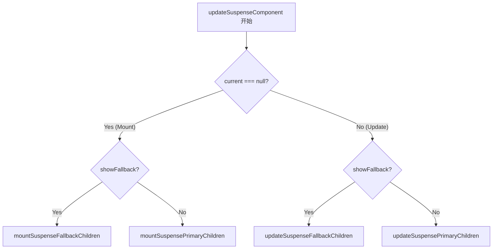

```jsx
<Suspense fallback={<div>loading...</div>}>
	<Cpn />
</Suspense>
```

正常状态，<Suspense/>渲染子孙组件

挂起状态，<Suspense/>渲染fallback

### 总之

「初始状态」 -> 「中间状态」 -> 「结束状态」 的流程

### Suspense实现思路



## 逻辑链条

起点：目的是什么？

- 在 `<Cpn />` 挂起时，显示 `fallback`

终点：react 官方 hook 是怎么用的？

### 静态：数据结构

ReactSymbols
createFiberFromElement
beginWork: updateSuspenseComponent

### 动态：更新流程的改造

#### create: jsx -> babel （静态编译） -> ReactElement（动态编译） -> FiberNode

《<Suspense>的创建: jsx->babel->ReactElement->Fibernode.md》

#### beginWork


