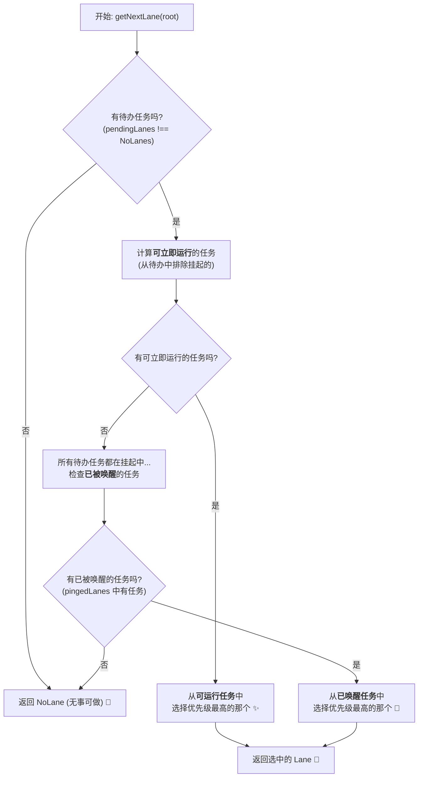

```mermaid
graph TD
    A["开始: getNextLane(root)"] --> B{"有待办任务吗?<br/>(pendingLanes !== NoLanes)"};
    B -- 否 --> F["返回 NoLane (无事可做) 🏁"];
    B -- 是 --> C["计算<b>可立即运行</b>的任务<br/>(从待办中排除挂起的)"];

    C --> D{"有可立即运行的任务吗?"};
    D -- 是 --> E["从<b>可运行任务</b>中<br/>选择优先级最高的那个 ✨"];
    E --> G["返回选中的 Lane 🚀"];

    D -- 否 --> H["所有待办任务都在挂起中...<br>检查<b>已被唤醒</b>的任务"];
    H --> I{"有已被唤醒的任务吗?<br/>(pingedLanes 中有任务)"};

    I -- 是 --> J["从<b>已唤醒任务</b>中<br/>选择优先级最高的那个 🔔"];
    J --> G;
    I -- 否 --> F;
```
