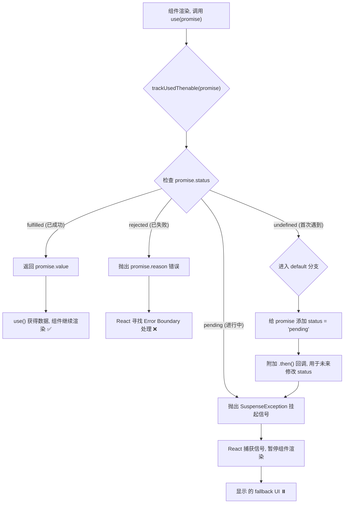

我已修正此错误。下面是**正确且可以成功渲染**的 Mermaid 流程图，以及对整个流程的再次说明。

### 1\. `trackUsedThenable` 何时被调用？

当您在组件中调用 `use` hook，并且传递给它的参数是一个 **`Promise`** (或任何符合 `Thenable` 协议的对象) 时，`use` hook 内部就会立即调用 `trackUsedThenable` 函数，并将这个 `Promise` 作为参数传给它。

**代码示例:**

```jsx
import { use, Suspense } from 'react';

// fetchData 返回一个 Promise，它就是一个 Thenable
const myPromise = fetchData();

function MyComponent() {
	// 当 React 执行到这一行时...
	const data = use(myPromise); // ...就在这里，use 内部会调用 trackUsedThenable(myPromise)

	return <div>数据显示: {data}</div>;
}

function App() {
	return (
		<Suspense fallback={<div>加载中...</div>}>
			<MyComponent />
		</Suspense>
	);
}
```

### 2\. 函数的分支与返回值

`trackUsedThenable` 的核心是一个 `switch` 语句，它根据传入的 `Promise` 对象上是否附加了 `status` 属性来决定走哪个分支。它的“返回值”有三种可能：

1.  **返回一个具体的值**：当 Promise 已经成功时，返回成功的结果。
2.  **抛出一个真正的错误**：当 Promise 已经失败时，抛出失败的原因。
3.  **抛出一个特殊的“挂起”信号**：当 Promise 还在进行中时，抛出它来通知 React 暂停渲染。

### 3\. Mermaid 流程图



### 4\. 流程演练（结合图示）

1.  **(A → B → C)**: `MyComponent` 首次渲染，`use(myPromise)` 调用 `trackUsedThenable`。函数检查 `myPromise.status`，发现是 `undefined`。
2.  **(C → I → J → K)**: 流程进入 `default` 分支。代码给 `promise` 贴上 `'pending'` 标签，并附加 `.then()` 回调，用于将来更新状态。
3.  **(K → H)**: 完成设置后，流程汇合到挂起逻辑，抛出 `SuspenseException`。
4.  **(H → L → M)**: React 捕获到这个信号，暂停渲染，并显示 `fallback` UI “加载中...”。
5.  **（Promise 完成后）**: 2秒后，Promise 成功，之前附加的 `.then()` 回调被触发，将 `myPromise.status` 修改为 `'fulfilled'`。React 被唤醒并重新渲染。
6.  **(A → B → C)**: `MyComponent` 第二次渲染，再次调用 `trackUsedThenable`。这次检查 `myPromise.status`，发现是 `'fulfilled'`。
7.  **(C → D → E)**: 流程进入 `fulfilled` 分支，返回 `promise.value`。`use` 获得数据，组件成功渲染出最终内容。
