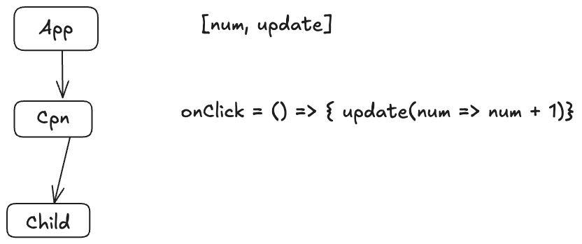

# useCallback

### 现有的问题

在理想情况下，当父组件 `App` 的状态 `num` 变化时，由于传递给 `Cpn` 的 `props` 没有变化，被 `React.memo` 包裹的 `Cpn` 的子组件 `Child` 应该跳过（Bailout）不必要的重新渲染。

然而，问题的根源在于 `App` 组件每次重新渲染时，都会创建一个全新的 `addOne` 函数实例。

这导致 `React.memo` 在对 `Cpn` 的 `props` 进行浅比较时，`oldProps.onClick !== newProps.onClick` 会因为函数引用的不同而判定为 `false`，从而导致优化失效， `Child` 被迫重新渲染。



```jsx
import { useState, memo, useCallback } from 'react';

export default function App() {
	const [num, update] = useState(0);
	console.log('App render ', num);

	const addOne = () => update((num) => num + 1), [];

	return (
		<div>
			<Cpn onClick={addOne} />
			{num}
		</div>
	);
}

const Cpn = memo(function ({ onClick }) {
	console.log('Cpn render');
	return (
		<div onClick={() => onClick()}>
			<Child />
		</div>
	);
});

function Child() {
	console.log('Child render');
	return <p>i am child</p>;
}
```

### 目的是什么？

缓存函数实例，以避免因函数引用变化而导致传递给已优化子组件（如 `React.memo` 组件）的 props 发生变化，从而阻止不必要的重复渲染。

### 实现思路

将函数本身和其依赖项数组一同存入 `hook.memoizedState`，只有在新旧依赖项对比发生变化时，才会用新传入的函数去更新这个缓存。

### 使用方法

```js
const addOne = useCallback(() => update((num) => num + 1), []);
```
