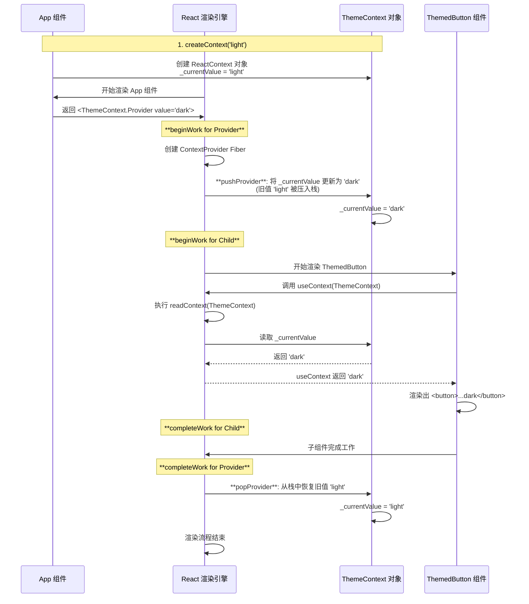

### 示例代码：一个简单的主题切换器

```jsx
import React, { createContext, useContext } from 'react';
import ReactDOM from 'react-dom/client';

// 1. 创建 Context
const ThemeContext = createContext('light'); // 默认主题是 'light'

// 3. 子组件，消费 Context
function ThemedButton() {
	console.log('ThemedButton is rendering...');
	// 调用 useContext
	const theme = useContext(ThemeContext);
	return <button>Current theme: {theme}</button>;
}

// 2. 父组件，提供 Context
function App() {
	return (
		<ThemeContext.Provider value="dark">
			<ThemedButton />
		</ThemeContext.Provider>
	);
}

ReactDOM.createRoot(document.getElementById('root')).render(<App />);
```

---

### 流程详解

#### 第1步：`createContext` 产生了什么？

当你调用 `const ThemeContext = createContext('light');` 时，你实际上创建并得到了一个 **`ReactContext` 对象**。这个对象被存储在 `ThemeContext` 这个变量中。

这个 **`ReactContext` 对象** 的数据结构如下：

```javascript
// ThemeContext 变量持有的对象
{
    // 一个特殊的 Symbol，用于告诉 React “我是一个 Context 对象”
    $$typeof: Symbol.for('react.context'), // 即 REACT_CONTEXT_TYPE

    // 存储这个 Context 当前的值，初始值就是你传入的 'light'
    _currentValue: 'light',

    // Provider 是一个内建的对象，它也有自己的类型标识
    Provider: {
        $$typeof: Symbol.for('react.provider'), // 即 REACT_PROVIDER_TYPE
        _context: { /* 指回 ThemeContext 对象本身，形成一个循环引用 */ }
    }
    // Consumer 属性（在现代 React 中已不常用）
}
```

**总结**: `createContext` 创建了一个**中心化**的、存储在普通变量 (`ThemeContext`) 里的对象。这个对象既包含了**当前值 (`_currentValue`)**，也包含了用于**修改这个值的组件 (`Provider`)**。

---

#### 第2步：`<ThemeContext.Provider>` Fiber 的创建与更新

1.  **JSX 到 Fiber 的创建**:

    - 在 `App` 组件中，`<ThemeContext.Provider value="dark">` 这段 JSX 会被编译成一个 React Element。
    - 这个 Element 的 `type` 属性不是一个字符串，而是 `ThemeContext.Provider` 这个对象。
    - 在父组件 (`App`) 的协调（reconciliation）过程中，React 发现这个 Element 的 `type.$$typeof` 是 `REACT_PROVIDER_TYPE`。
    - 因此，React 会创建一个 `tag` 为 **`ContextProvider`** 的 **Fiber 节点**来代表它。这个 Fiber 节点的 `child` 会指向为 `<ThemedButton />` 创建的 Fiber。

2.  **Fiber 的更新过程 (`beginWork` 和 `completeWork`)**:

    - **`beginWork` (递阶段)**:

      - 当 React 的 `workLoop` 处理到这个 `ContextProvider` Fiber 时，会调用 `beginWork`。
      - `beginWork` 内部检测到其 `tag` 是 `ContextProvider`，于是调用 `updateContextProvider` 函数。
      - `updateContextProvider` 的核心是调用 `pushProvider('dark')`。这个操作会：
        1.  把 `ThemeContext._currentValue` 的旧值 (`'light'`) 保存到一个全局的**栈** (`prevContextValueStack`) 中。
        2.  **将 `ThemeContext._currentValue` 的值更新为 `'dark'`。**
      - `beginWork` 完成后，React 继续向下处理它的子节点，也就是 `ThemedButton` 的 Fiber。

    - **`completeWork` (归阶段)**:

      - 在 `ThemedButton` 的 `completeWork` 完成后，轮到 `ContextProvider` Fiber 执行 `completeWork`。
      - `completeWork` 检测到其 `tag` 是 `ContextProvider`。
      - 它会调用 `popProvider()`。这个操作会：
        1.  从那个全局的**栈**中弹出之前保存的旧值 (`'light'`)。
        2.  **将 `ThemeContext._currentValue` 的值恢复为 `'light'`。**
      - 这样就确保了 `Provider` 的影响范围被严格限制在其子树之内。

---

#### 第3步：子组件的创建与 `useContext`

1.  **子组件创建**:

    - `ThemedButton` 的 Fiber 节点是在其父级 (`ContextProvider` Fiber) 的 `beginWork` 阶段被创建的，作为其 `child`。

2.  **`useContext` 发生什么**:

    - 轮到 `ThemedButton` 的 Fiber 执行 `beginWork` 时，React 会调用 `renderWithHooks` 来渲染这个函数组件。
    - 代码执行到 `const theme = useContext(ThemeContext);`。
    - `useContext` Hook 内部会调用 `readContext(ThemeContext)` 函数。
    - **`readContext` 的工作非常直接**：它直接去 `ThemeContext` 这个**中心对象**上，读取 `_currentValue` 属性的**当前值**。
    - **关键点**：因为这个读取操作发生在父级 `Provider` 的 `beginWork` (已将值更新为 `'dark'`) 之后，且在它的 `completeWork` (将值恢复为 `'light'`) 之前，所以 `readContext` 读取到的值正是 `'dark'`。
    - `theme` 变量被赋值为 `'dark'`，组件最终渲染出 `<button>Current theme: dark</button>`。

---

### Mermaid 图解完整流程

这张图将上述所有步骤串联起来，展示了数据和控制流的走向。


