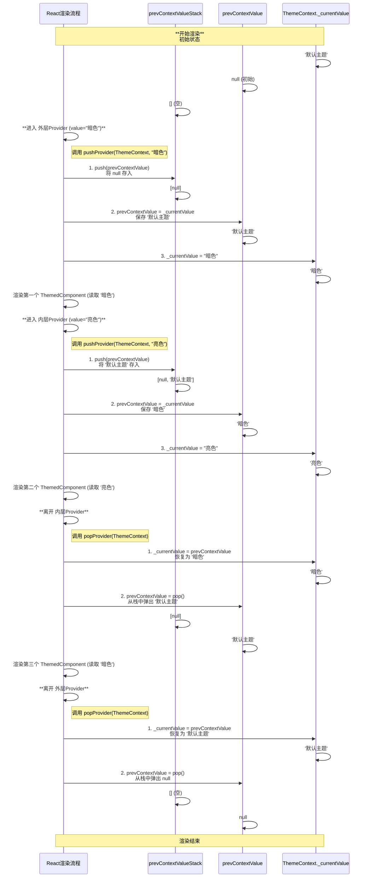

### 示例代码

```jsx
const ThemeContext = createContext('默认主题');

function App() {
	return (
		<ThemeContext.Provider value="暗色">
			<ThemedComponent />
			<ThemeContext.Provider value="亮色">
				<ThemedComponent />
			</ThemeContext.Provider>
			<ThemedComponent />
		</ThemeContext.Provider>
	);
}
```

### 核心机制：一个栈，一个临时变量

- **`prevContextValueStack`**: 把它想象成一个**后进先出**的“保险箱”。每当我们遇到一个更深层的 `Provider`，就把当前 `Provider` 的值存进去。
- **`prevContextValue`**: 这是一个“临时工”变量，它帮助完成值的交换，在 `push` 和 `pop` 操作中临时持有上一个作用域的值。

### Mermaid 图解：变量状态的全程追踪


