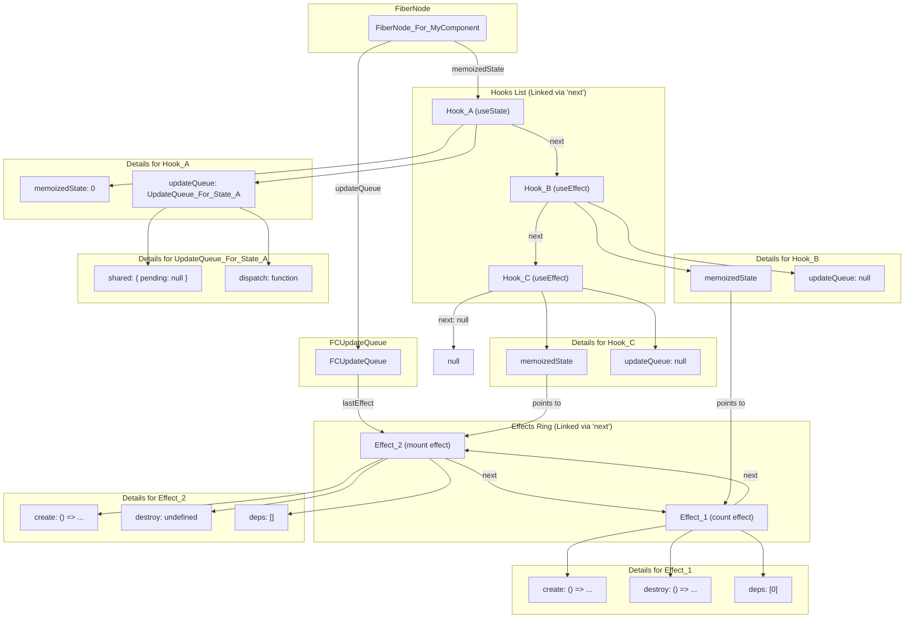

### 模拟场景组件

```js
function MyComponent() {
	// Hook 1: useState
	const [count, setCount] = useState(0);

	// Hook 2: useEffect
	useEffect(() => {
		console.log('Component mounted or count changed');
		return () => console.log('Cleanup for count effect');
	}, [count]);

	// Hook 3: useEffect
	useEffect(() => {
		console.log('Component mounted');
	}, []);
}
```

### Mermaid 结构图

代码段



### 图解说明

1. **FiberNode**: 这是我们数据结构的起点，代表 `MyComponent` 组件。
2. **`memoizedState` -> Hooks List**: `FiberNode` 的 `memoizedState` 指针指向一个**线性的单向链表**，这个链表按照 Hooks 的调用顺序（`useState`, `useEffect`, `useEffect`）串联起所有的 `Hook` 对象。
3. **`updateQueue` -> FCUpdateQueue**: `FiberNode` 的 `updateQueue` 指针指向一个**唯一的 `FCUpdateQueue` 对象**。这个对象是该组件所有 `useEffect` 共享的。
4. **FCUpdateQueue -> Effects Ring**: `FCUpdateQueue` 内部通过 `lastEffect` 指针，指向 `useEffect` 们组成的**环形链表**的最后一个节点（这里是 `Effect_2`）。
5. **Hooks 与 Effects 的关联**:

   - `useState` 类型的 `Hook` (`Hook_A`)，它的 `memoizedState` 直接存储状态值 (`0`)，并且它的 `updateQueue` 指向一个独立的、专属于它自己的 `UpdateQueue`。
   - `useEffect` 类型的 `Hook` (`Hook_B`, `Hook_C`)，它的 `memoizedState` 则是一个指针，指向其在 **Effects 环形链表**中对应的那个 `Effect` 对象。
