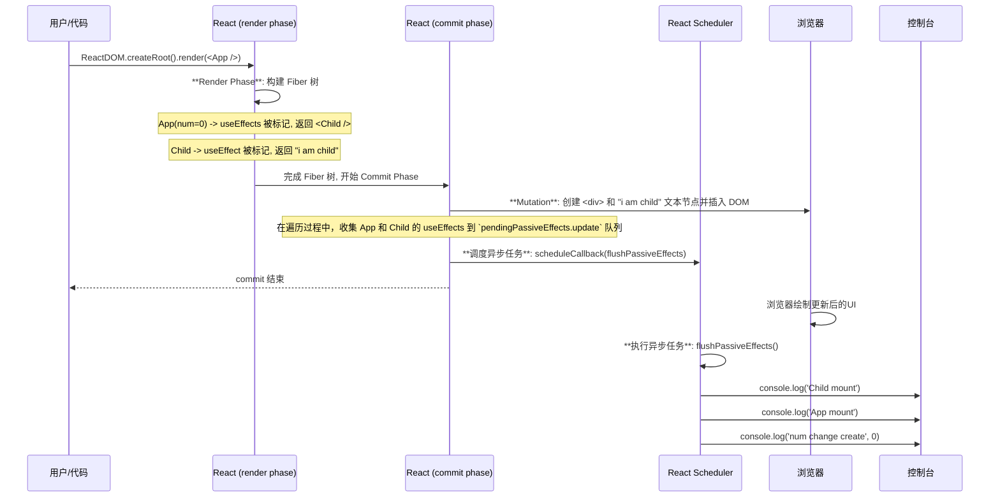
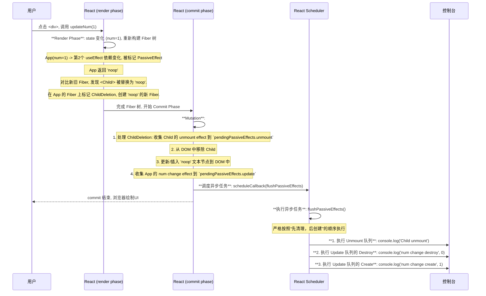

## 例子

代码

```jsx
import React, { useEffect } from 'react';
import { useState } from 'react';

import ReactDOM from 'react-dom/client';

function App() {
	const [num, updateNum] = useState(0);
	useEffect(() => {
		console.log('App mount');
	}, []);

	useEffect(() => {
		console.log('num change create', num);
		return () => {
			console.log('num change destroy', num);
		};
	}, [num]);

	return (
		<div onClick={() => updateNum(num + 1)}>
			{num === 0 ? <Child /> : 'noop'}
		</div>
	);
}

function Child() {
	useEffect(() => {
		console.log('Child mount');
		return () => console.log('Child unmount');
	}, []);

	return 'i am child';
}

ReactDOM.createRoot(document.getElementById('root') as HTMLElement).render(
	<App />
);
```

## 1. 挂载

### 打印结果

```js
Child mount
App mount
num change create 0
```

挂载时 `useEffect` 的执行顺序是 **`Child mount` -> `App mount` -> `num change create 0`**，这个顺序是由 React 在 **commit 阶段**对 Fiber 树进行**深度优先遍历 (Depth-First Search, DFS)** 的机制决定的。

#### 1. Commit 阶段：副作用的“收集”

当 render 阶段结束后，React 得到了一棵新的 Fiber 树 (`finishedWork`)。commit 阶段会遍历这棵树来执行 DOM 操作和收集副作用。

- **遍历开始**: `commitMutationEffects` 函数从根节点开始，以深度优先的方式向下遍历。
- **到达最深的叶子节点**: 遍历会首先深入到树的最深处，也就是 `<Child />` 组件。
- **收集 `Child` 的 Effect**: React 发现 `Child` 组件的 Fiber 节点上带有 `PassiveEffect` 标记。它会调用 `commitPassiveEffect`，将 `Child` 组件的 `useEffect` **收集**到 `root.pendingPassiveEffects.update` 队列中。
  - `pendingPassiveEffects.update` 队列现在是: `[ <Child's mount effect> ]`
- **回溯到 `App`**: `Child` 没有子节点了，遍历回溯到父节点 `<App />`。
- **收集 `App` 的 Effects**: React 发现 `App` 组件的 Fiber 节点也带有 `PassiveEffect` 标记。它会再次调用 `commitPassiveEffect`，将 `App` 的两个 `useEffect` **按其在代码中的定义顺序**，依次收集到队列的末尾。
  - `pendingPassiveEffects.update` 队列现在是: `[ <Child's mount effect>, <App's first effect>, <App's second effect> ]`

#### 2. Passive Effects Flush 阶段：副作用的“执行”

在 commit 阶段的最后，React 会异步调度 `flushPassiveEffects` 函数。当这个函数被执行时，它会严格按照队列中的顺序来执行 `useEffect` 的创建（`create`）函数。

1.  **执行第一个任务**: 从队列中取出 `<Child's mount effect>` 并执行它的 `create` 函数。
    - **控制台打印**: `Child mount`
2.  **执行第二个任务**: 从队列中取出 `<App's first effect>` 并执行它的 `create` 函数。
    - **控制台打印**: `App mount`
3.  **执行第三个任务**: 从队列中取出 `<App's second effect>` 并执行它的 `create` 函数。
    - **控制台打印**: `num change create 0`

### 为什么是这个顺序？

这种**子组件优先**的执行顺序是经过精心设计的。它保证了当一个父组件的 `useEffect` 执行时，它的所有子组件都已经被挂载，并且子组件的 `useEffect` 也已经执行完毕。这对于那些需要依赖子组件 DOM 节点或状态的父组件副作用来说，是非常重要的。例如，父组件可能需要在 `useEffect` 中测量由子组件渲染出的 DOM 元素的大小。

### 流程图



## 2. 更新

### 流程图


