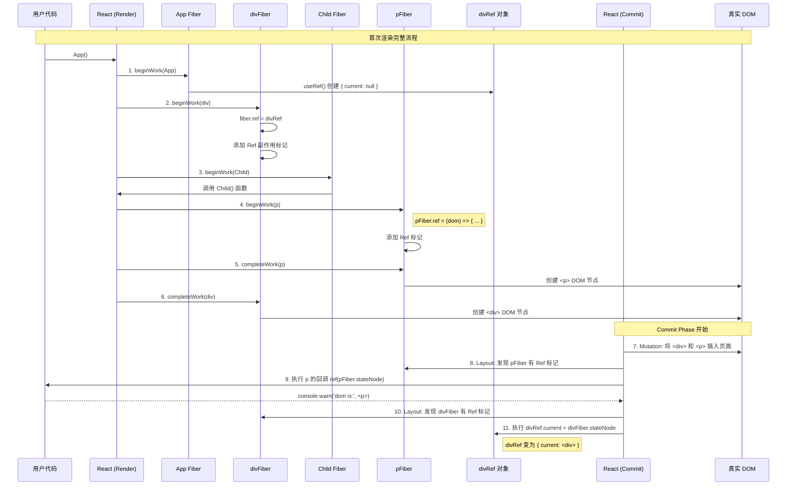

###



带有useEffect

```mermiad
sequenceDiagram
    participant User as 用户代码
    participant React as React (Render)
    participant AppFiber as App Fiber
    participant DivFiber as divFiber
    participant PFiber as pFiber
    participant RefObj as divRef 对象
    participant Commit as React (Commit)
    participant DOM as 真实 DOM

    Note over User, DOM: 首次渲染完整流程

    %% --- Render Phase ---
    User->>React: App()
    React->>AppFiber: 1. beginWork(App)
    AppFiber->>RefObj: useRef() 创建 { current: null }
    AppFiber->>AppFiber: useEffect() 注册回调, 添加 PassiveEffect 标记

    React->>DivFiber: 2. beginWork(div)
    DivFiber->>DivFiber: fiber.ref = divRef 添加 Ref 标记

    React->>PFiber: 3. beginWork(p)
    Note right of PFiber: pFiber.ref = (dom) => { ... }
    PFiber->>PFiber: 添加 Ref 标记

    React->>PFiber: 4. completeWork(p)
    PFiber->>DOM: 创建 <p> DOM 节点

    React->>DivFiber: 5. completeWork(div)
    DivFiber->>DOM: 创建 <div> DOM 节点

    %% --- Commit Phase ---
    Note over Commit, DOM: Commit Phase 开始
    Commit->>DOM: 6. Mutation: 将 <div> 和 <p> 插入页面
    Commit->>AppFiber: 7. Mutation: 发现 PassiveEffect 标记, 将 useEffect 回调推入队列

    Commit->>PFiber: 8. Layout: 发现 pFiber 有 Ref 标记
    Commit->>User: 执行 p 的回调 ref(pFiber.stateNode)

    Commit->>DivFiber: 9. Layout: 发现 divFiber 有 Ref 标记
    Commit->>RefObj: 执行 divRef.current = divFiber.stateNode
    Note right of RefObj: divRef 变为 { current: <div> }

    %% --- Passive Effects Phase ---
    Note over User, Commit: Commit Phase 结束, 异步调度 Passive Effects
    Commit->>User: 10. flushPassiveEffects: 执行 useEffect 回调
    User->>RefObj: 读取 divRef.current
    RefObj-->>User: 返回 <div> 节点
    User-->>Commit: console.warn('useEffect divRef', <div)
```
