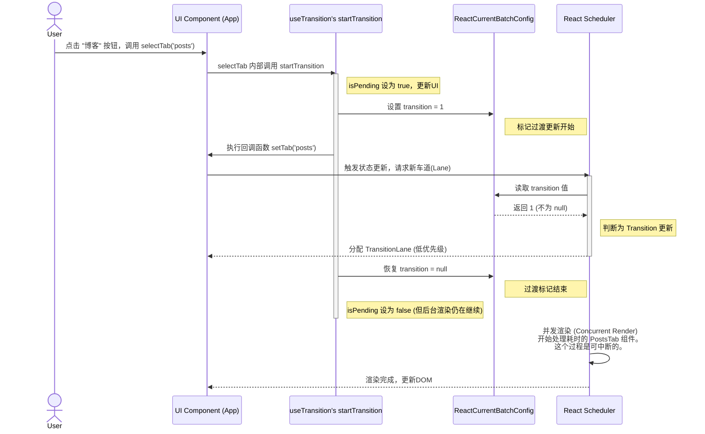

用来告知 React 当前是否处于一个 "transition" 中

当使用 `useTransition` Hook 返回的 `startTransition` 函数时，`ReactCurrentBatchConfig.transition` 的值会被临时设置为 1

该更新会被赋予一个较低的 TransitionLane 优先级

### 流程图

```mermaid
sequenceDiagram
    actor User
    participant Component as UI Component (App)
    participant startTransition as useTransition's startTransition
    participant BatchConfig as ReactCurrentBatchConfig
    participant Scheduler as React Scheduler

    User->>Component: 点击 "博客" 按钮，调用 selectTab('posts')

    Component->>startTransition: selectTab 内部调用 startTransition

    activate startTransition
    Note right of startTransition: isPending 设为 true，更新UI

    startTransition->>BatchConfig: 设置 transition = 1
    Note right of BatchConfig: 标记过渡更新开始

    startTransition->>Component: 执行回调函数 setTab('posts')
    Component->>Scheduler: 触发状态更新，请求新车道(Lane)

    activate Scheduler
    Scheduler->>BatchConfig: 读取 transition 值
    BatchConfig-->>Scheduler: 返回 1 (不为 null)
    Note right of Scheduler: 判断为 Transition 更新
    Scheduler-->>Component: 分配 TransitionLane (低优先级)
    deactivate Scheduler

    startTransition->>BatchConfig: 恢复 transition = null
    Note right of BatchConfig: 过渡标记结束
    Note right of startTransition: isPending 设为 false (但后台渲染仍在继续)
    deactivate startTransition

    participant Component
    Scheduler->>Scheduler: 并发渲染 (Concurrent Render)<br/>开始处理耗时的 PostsTab 组件。<br/>这个过程是可中断的。
    Scheduler-->>Component: 渲染完成，更新DOM
```
