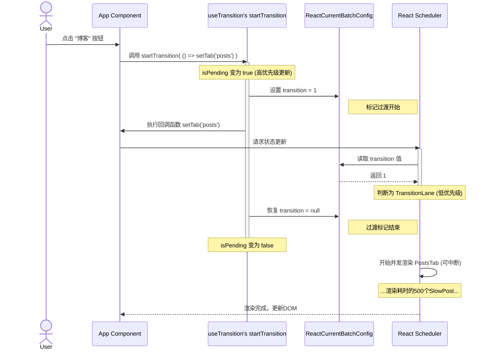

### 场景说明

创建了一个带有三个标签页（“首页”、“博客”、“联系我”）的简单应用。其中，“博客”标签页 (`PostsTab.tsx`) 被设计为渲染缓慢的组件，它会循环 500 次，每次都人为地延迟一下，以此来模拟一个耗时的渲染任务。

**目标**：当用户点击“博客”这个慢标签页时，我们不希望整个应用卡死，而是希望应用能立即响应，并平滑地过渡到新的内容。

### 核心流程详解

1.  **用户点击，启动 Transition**
    当用户点击“博客 (render慢)”按钮时，`onClick` 事件触发了 `selectTab('posts')` 函数。

    _`demos/transition/main.tsx`_

    ```tsx
    function selectTab(nextTab) {
    	// 关键：将状态更新包裹在 startTransition 中
    	startTransition(() => {
    		setTab(nextTab);
    	});
    }
    ```

2.  **`startTransition` 的工作**
    `startTransition` 函数立即执行，它做了两件核心事情：

    - **更新 pending 状态**：它调用 `setPending(true)`，将 `isPending` 状态设为 `true`。这会立刻触发一次**高优先级**的渲染，让UI可以立即响应（例如，显示一个加载指示器）。
    - **标记过渡更新**：它在内部将一个全局配置 `ReactCurrentBatchConfig.transition` 的值设为 `1`。

3.  **触发低优先级更新**
    在 `startTransition` 的回调函数中，`setTab('posts')` 被执行。这次 `setTab` 调用触发了一次状态更新。当 React 为这次更新分配优先级时，它会检查 `ReactCurrentBatchConfig.transition`。由于该值不为 `null`，React 知道这是一个低优先级的过渡更新，并为其分配一个 `TransitionLane`。

4.  **恢复与并发渲染**
    `startTransition` 的回调函数执行完毕后，它会立刻：

    - 将 `ReactCurrentBatchConfig.transition` 恢复为 `null`。
    - 调用 `setPending(false)`。

    此时，React 的调度器已经接收到了一个低优先级的渲染任务（渲染 `<PostsTab />`）。调度器会以**并发（Concurrent）模式**来执行这个任务。这意味着：

    - 渲染过程是**可中断的**。如果在渲染这 500 个 `<SlowPost />` 的过程中，用户又点击了“首页”按钮，React 会立即暂停当前的慢渲染，转而去优先处理更高优先级的点击事件，保持了界面的响应性。
    - 在浏览器空闲时，React 会继续完成被中断的渲染任务。

### 图


