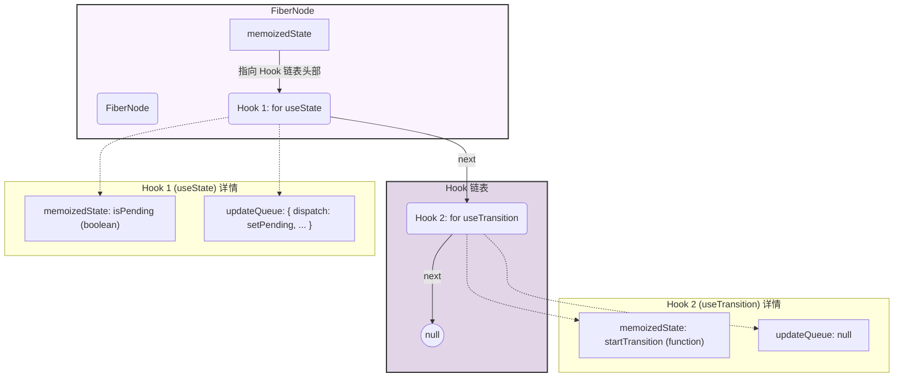

调用 const [isPending, startTransition] = useTransition(); 时，React 并不是只创建一个 Hook，而是创建了两个。

第一个 Hook (Hook 1) 实际上是一个内部的 useState。

它的 memoizedState 存储了 isPending 的布尔值 (true 或 false)。

它的 updateQueue 包含了更新这个状态的逻辑，即 setPending 函数。

第二个 Hook (Hook 2) 才是 useTransition 自身。

它的 memoizedState 非常特别，直接存储了**startTransition 函数本身**。

这个 Hook 没有自己的更新队列 (updateQueue 为 null)，因为它不直接管理状态，而是通过第一个 useState Hook 来更新 isPending 状态。

### 图

