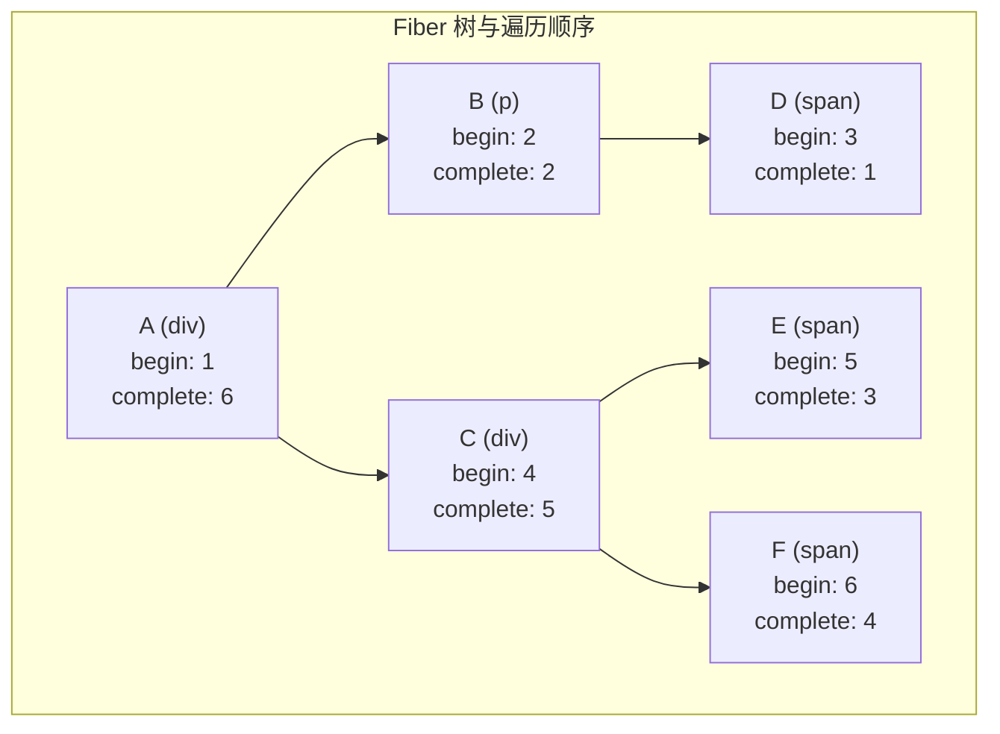

```js
function workLoop() {
	while (workInProgress !== null) {
		performUnitOfWork(workInProgress);
	}
}

function performUnitOfWork(fiber: FiberNode) {
	const next = beginWork(fiber);
	fiber.memoizedProps = fiber.pendingProps;

	if (next === null) {
		completeUnitOfWork(fiber);
	} else {
		workInProgress = next;
	}
}

function completeUnitOfWork(fiber: FiberNode) {
	let node: FiberNode | null = fiber;
	while (node !== null) {
		completeWork(node);
		const sibling = node.sibling;
		if (sibling !== null) {
			workInProgress = sibling;
			return;
		}
		node = node.return;
		workInProgress = node;
	}
}
```
