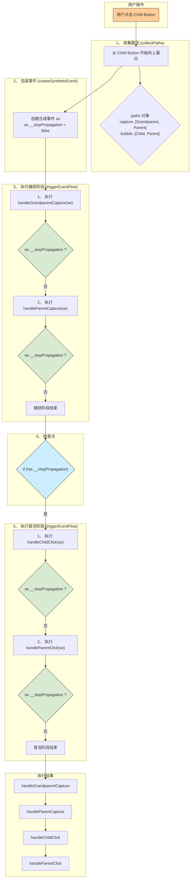

### 直观的例子

```js
// 祖父：只在捕获阶段监听
<div onClickCapture={handleGrandparentCapture} id="grandparent">
	// 父亲：捕获和冒泡阶段都监听
	<div
		onClickCapture={handleParentCapture}
		onClick={handleParentClick}
		id="parent"
	>
		// 孩子：只在冒泡阶段监听
		<button onClick={handleChildClick} id="child">
			点击我
		</button>
	</div>
</div>
```

### 流程图



### 事件全流程解析

#### 第 0 步：初始化

应用加载时，`initEvent(container, 'click')` 已经执行。这意味着只有一个原生的点击事件监听器被绑定在了最外层的根容器上。

#### 第 1 步：用户点击

用户点击了 ID 为 `child` 的 `<button>` 元素。浏览器产生一个原生事件 `e`，其中 `e.target` 就是这个 `<button>` 元素。这个事件最终冒泡到根容器，触发了我们唯一的监听器。

#### 第 2 步：进入 `dispatchEvent`

根容器的监听器被触发，调用 `dispatchEvent(container, 'click', e)`。事件处理的“总指挥室”开始工作。

#### 第 3 步：`collectPaths` - 规划执行路径

`dispatchEvent` 首先调用 `collectPaths` 来收集所有需要执行的事件处理函数。

1. **起点**：`e.target`，也就是 `<button id="child">`。
2. **在 `child` 元素**：找到 `onClick: handleChildClick`。这是一个冒泡事件，所以 `handleChildClick` 被 `push` 进 `bubble` 数组。

   - `capture`: `[]`
   - `bubble`: `[handleChildClick]`

3. **向上到 `parent` 元素**：找到 `onClickCapture: handleParentCapture` 和 `onClick: handleParentClick`。

   - `handleParentCapture` 是捕获事件，被 `unshift` 到 `capture` 数组的**开头**。
   - `handleParentClick` 是冒泡事件，被 `push` 进 `bubble` 数组的**末尾**。
   - `capture`: `[handleParentCapture]`
   - `bubble`: `[handleChildClick, handleParentClick]`

4. **向上到 `grandparent` 元素**：找到 `onClickCapture: handleGrandparentCapture`。

   - `handleGrandparentCapture` 是捕获事件，被 `unshift` 到 `capture` 数组的**开头**。
   - `capture`: `[handleGrandparentCapture, handleParentCapture]`
   - `bubble`: `[handleChildClick, handleParentClick]`

5. **收集完成**：`collectPaths` 返回一个包含两条执行路径的 `paths` 对象。

#### 第 4 步：`createSyntheticEvent` - 包装事件

`dispatchEvent` 调用 `createSyntheticEvent(e)`，将原生事件 `e` 包装成合成事件 `se`。此时，一个关键的“信号旗”被初始化：`se.__stopPropagation = false`。

#### 第 5 步：`triggerEventFlow` - 执行捕获阶段

`dispatchEvent` 首先处理捕获路径。它调用 `triggerEventFlow(paths.capture, se)`。

1. 执行 `capture` 数组的第一个函数：`handleGrandparentCapture(se)`。
2. 执行完毕，检查信号旗 `se.__stopPropagation`。它仍然是 `false`。
3. 执行 `capture` 数组的第二个函数：`handleParentCapture(se)`。
4. 执行完毕，再次检查信号旗 `se.__stopPropagation`。它还是 `false`。
5. 捕获阶段的任务清单执行完毕。

#### 第 6 步：检查“全局停止信号”

在捕获阶段和冒泡阶段之间，`dispatchEvent` 会检查一次信号旗：`if (!se.__stopPropagation)`。因为信号旗还是 `false`，所以条件成立，流程继续。

#### 第 7 步：`triggerEventFlow` - 执行冒泡阶段

`dispatchEvent` 接着处理冒泡路径。它调用 `triggerEventFlow(paths.bubble, se)`。

1. 执行 `bubble` 数组的第一个函数：`handleChildClick(se)`。
2. 执行完毕，检查信号旗 `se.__stopPropagation`。它仍然是 `false`。
3. 执行 `bubble` 数组的第二个函数：`handleParentClick(se)`。
4. 执行完毕，检查信号旗。它还是 `false`。
5. 冒泡阶段的任务清单执行完毕。

---

### 加入 `stopPropagation` 的变化

现在，我们稍微修改一下场景：**假设 `handleParentCapture` 函数内部调用了 `e.stopPropagation()`。**

那么流程在 **第 5 步** 就会发生巨大变化：

1. `triggerEventFlow` 执行 `handleGrandparentCapture(se)`。一切正常。
2. 接着执行 `handleParentCapture(se)`。**在此函数内部，`se.stopPropagation()` 被调用**。这会导致 `se.__stopPropagation` 这个“信号旗”被立即设置为 `true`。
3. `handleParentCapture` 执行完毕后，`triggerEventFlow` 检查信号旗，发现它已经是 `true`！于是，`triggerEventFlow` **立即 `break` 循环**，捕获阶段的执行到此中断。
4. 流程回到 **第 6 步**，`dispatchEvent` 检查 `if (!se.__stopPropagation)`。此时 `se.__stopPropagation` 是 `true`，所以 `if` 条件不成立。
5. 因此，**整个冒泡阶段（第 7 步）将被完全跳过**。

最终，只有 `handleGrandparentCapture` 和 `handleParentCapture` 被执行。
