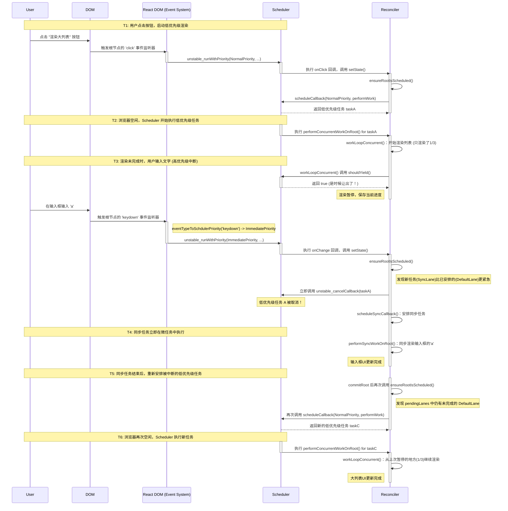

### 图

```mermaid
sequenceDiagram
    participant User
    participant DOM
    participant EventSystem as React DOM (Event System)
    participant Scheduler
    participant Reconciler

    %% ====================== PART 1: 低优先级任务启动 ======================
    Note over User, Scheduler: T1: 用户点击按钮，启动低优先级渲染
    User->>DOM: 点击 "渲染大列表" 按钮
    DOM->>EventSystem: 触发根节点的 'click' 事件监听器

    activate EventSystem
    EventSystem->>Scheduler: unstable_runWithPriority(NormalPriority, ...)
    deactivate EventSystem

    activate Scheduler
    Scheduler->>Reconciler: 执行 onClick 回调，调用 setState()
    deactivate Scheduler

    activate Reconciler
    Reconciler->>Reconciler: ensureRootIsScheduled()
    Reconciler->>Scheduler: scheduleCallback(NormalPriority, performWork)
    Scheduler-->>Reconciler: 返回低优先级任务 taskA
    deactivate Reconciler

    %% ====================== PART 2: 并发渲染开始 ======================
    Note over User, Scheduler: T2: 浏览器空闲，Scheduler 开始执行低优先级任务
    activate Scheduler
    Scheduler->>Reconciler: 执行 performConcurrentWorkOnRoot() for taskA
    deactivate Scheduler

    activate Reconciler
    Reconciler->>Reconciler: workLoopConcurrent()：开始渲染列表 (只渲染了1/3)

    %% ====================== PART 3: 高优先级任务中断 ======================
    Note over User, Scheduler: T3: 渲染未完成时，用户输入文字 (高优先级中断)

    Reconciler->>Scheduler: workLoopConcurrent() 调用 shouldYield()
    activate Scheduler
    Scheduler-->>Reconciler: 返回 true (是时候让出了！)
    deactivate Scheduler
    Note left of Reconciler: 渲染暂停，保存当前进度
    deactivate Reconciler

    User->>DOM: 在输入框输入 'a'
    DOM->>EventSystem: 触发根节点的 'keydown' 事件监听器

    activate EventSystem
    Note right of EventSystem: eventTypeToSchdulerPriority('keydown') -> ImmediatePriority
    EventSystem->>Scheduler: unstable_runWithPriority(ImmediatePriority, ...)
    deactivate EventSystem

    activate Scheduler
    Scheduler->>Reconciler: 执行 onChange 回调，调用 setState()
    deactivate Scheduler

    activate Reconciler
    Reconciler->>Reconciler: ensureRootIsScheduled()
    Note right of Reconciler: 发现新任务(SyncLane)比已安排的(DefaultLane)更紧急
    Reconciler->>Scheduler: 立即调用 unstable_cancelCallback(taskA)
    Note over Scheduler: 低优先级任务 A 被取消！
    Reconciler->>Reconciler: scheduleSyncCallback()：安排同步任务

    %% ====================== PART 4: 同步任务执行 ======================
    Note over User, Scheduler: T4: 同步任务立即在微任务中执行
    Reconciler->>Reconciler: performSyncWorkOnRoot()：同步渲染输入框的'a'
    Note left of Reconciler: 输入框UI更新完成
    deactivate Reconciler

    %% ====================== PART 5: 低优先级任务恢复 ======================
    Note over User, Scheduler: T5: 同步任务结束后，重新安排被中断的低优先级任务
    activate Reconciler
    Reconciler->>Reconciler: commitRoot 后再次调用 ensureRootIsScheduled()
    Note right of Reconciler: 发现 pendingLanes 中仍有未完成的 DefaultLane
    Reconciler->>Scheduler: 再次调用 scheduleCallback(NormalPriority, performWork)
    Scheduler-->>Reconciler: 返回新的低优先级任务 taskC
    deactivate Reconciler

    %% ====================== PART 6: 低优先级任务完成 ======================
    Note over User, Scheduler: T6: 浏览器再次空闲，Scheduler 执行新任务
    activate Scheduler
    Scheduler->>Reconciler: 执行 performConcurrentWorkOnRoot() for taskC
    deactivate Scheduler

    activate Reconciler
    Reconciler->>Reconciler: workLoopConcurrent()：从上次暂停的地方(1/3)继续渲染
    Note left of Reconciler: 大列表UI更新完成
    deactivate Reconciler
```
