memoizedState：是更新完成的最终结果

新增baseState、baseQueue字段：

1. baseState是本次更新参与计算的初始state，memoizedState是上次更新计算的最终state

2. 如果本次更新没有update被跳过，则下次更新开始时baseState === memoizedState

3. 如果本次更新有update被跳过，则本次更新计算出的memoizedState为「考虑优先级」情况下计算的结果，baseState为「最后一个没被跳过的update计算后的结果」，下次更新开始时baseState !== memoizedState

4. 本次更新「被跳过的update及其后面的所有update」都会被保存在baseQueue中参与下次state计算

5. 本次更新「参与计算但保存在baseQueue中的update」，优先级会降低到NoLane

## 一个例子

```js
// u0
{
  action: num => num + 1,
  lane: DefaultLane
}
// u1
{
  action: 3,
  lane: SyncLane
}
// u2
{
  action: num => num + 10,
  lane: DefaultLane
}

/*
* 第一次render
* baseState = 0; memoizedState = 0;
* baseQueue = null; updateLane = DefaultLane;
* 第一次render 第一次计算
* baseState = 1; memoizedState = 1;
* baseQueue = null;
* 第一次render 第二次计算
* baseState = 1; memoizedState = 1;
* baseQueue = u1;
* 第一次render 第三次计算
* baseState = 1; memoizedState = 11;
* baseQueue = u1 -> u2(NoLane);
*/

/*
* 第二次render
* baseState = 1; memoizedState = 11;
* baseQueue = u1 -> u2(NoLane); updateLane = SyncLane
* 第二次render 第一次计算
* baseState = 3; memoizedState = 3;
* 第二次render 第二次计算
* baseState = 13; memoizedState = 13;
*/

```

### 图

```mermaid
graph TD
    subgraph "初始状态"
        A["<b>初始值</b><br/>baseState: 0<br/>memoizedState: 0<br/>Update Queue: u0, u1, u2"]
    end

    A --> R1_Start

    subgraph "第一次 Render (renderLane: DefaultLane)"
        R1_Start("<b>开始 Render 1</b><br/>当前 render 的优先级: DefaultLane<br/>计算起始 state: 0")

        R1_Start -- "处理 u0 (DefaultLane) ✅<br/>优先级足够" --> R1_Proc_u0
        R1_Proc_u0("<b>处理 u0 后</b><br/>newState = u0(0) = 1<br/>baseState: 1<br/>memoizedState: 1")

        R1_Proc_u0 -- "处理 u1 (SyncLane) ❌<br/>(跳过，因为 SyncLane > DefaultLane)" --> R1_Proc_u1
        R1_Proc_u1("<b>跳过 u1 后</b><br/>baseState: 1 (不变，是最后一个未跳过 update 的结果)<br/>baseQueue: u1")

        R1_Proc_u1 -- "处理 u2 (DefaultLane) ✅<br/>优先级足够" --> R1_Proc_u2
        R1_Proc_u2("<b>处理 u2 后 (Render 1 结束)</b><br/><b>memoizedState</b> = u2(u0(0)) = 11 (合并所有未跳过 update 的最终结果)<br/><b>baseState</b>: 1 (保持不变)<br/><b>baseQueue</b>: u1 -> u2(NoLane) (u2 因在被跳过的 u1 之后，也被加入队列且降级)")
    end

    R1_Proc_u2 --> R2_Start

    subgraph "第二次 Render (renderLane: SyncLane)"
        R2_Start("<b>开始 Render 2</b><br/>当前 render 的优先级: SyncLane<br/>计算起始 state (使用上次的 baseState): 1")

        R2_Start -- "从 baseQueue 处理 u1 ✅" --> R2_Proc_u1
        R2_Proc_u1("<b>处理 u1 后</b><br/>newState = u1(baseState=1) = 3 (action 为值，直接替换)<br/>baseState: 3<br/>memoizedState: 3")

        R2_Proc_u1 -- "从 baseQueue 处理 u2(NoLane) ✅" --> R2_Proc_u2
        R2_Proc_u2("<b>处理 u2 后 (Render 2 结束)</b><br/>newState = u2(baseState=3) = 13<br/>baseState: 13<br/>memoizedState: 13")
    end

    R2_Proc_u2 --> R2_End

    subgraph "最终状态"
        R2_End("<b>Render 2 完成</b><br/>没有 update 被跳过<br/>baseQueue 为空<br/>baseState === memoizedState")
    end
```


