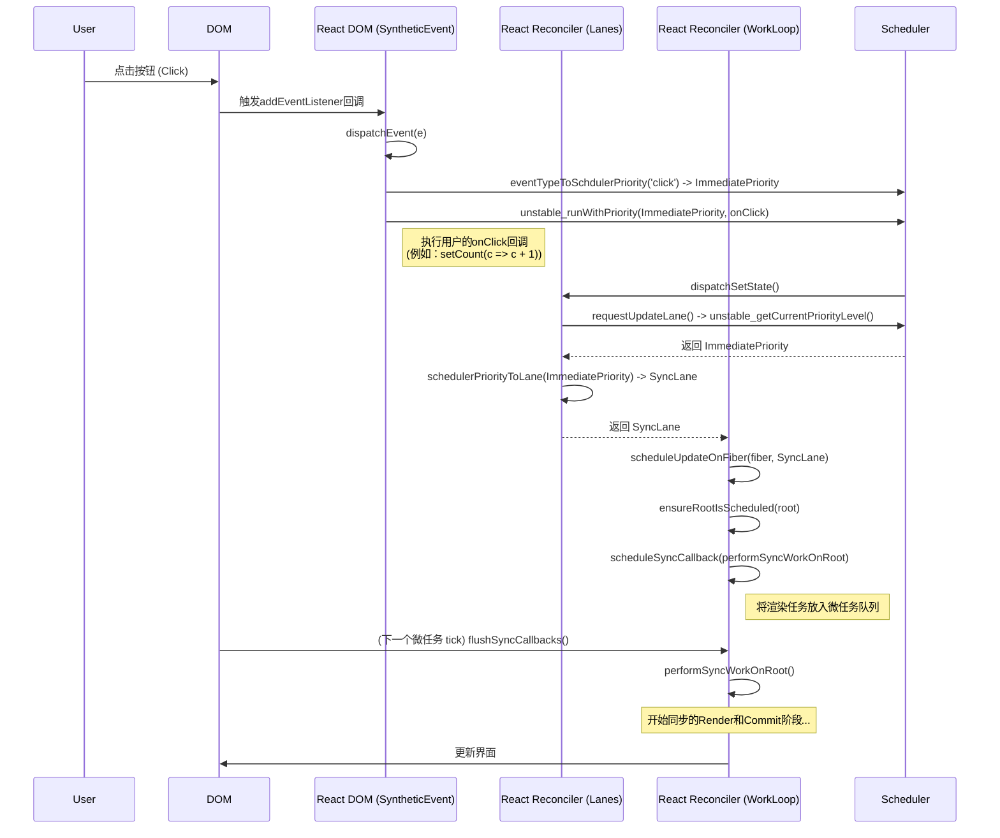
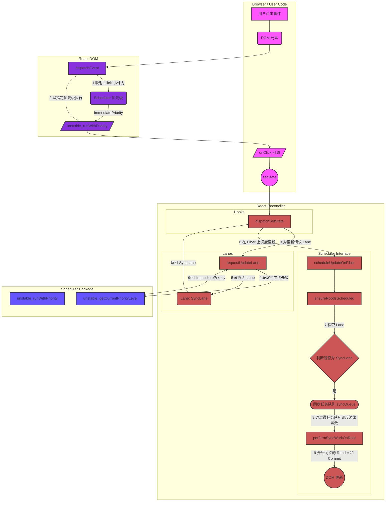

## 长话短说

1.  **事件触发 Scheduler 优先级系统**：用户的点击等操作通过 `SyntheticEvent` 系统被赋予一个初始的 Scheduler 优先级（如 `ImmediatePriority`）。
2.  **State 根据 Scheduler 优先级获得 Lane**：`setState` 在这个高优先级的上下文中被调用，因此 `requestUpdateLane` 会“读取”到这个优先级，并将其翻译成 React 内部的 `Lane`（如 `SyncLane`）。

3.  **整个 react的render、commit 阶段都是根据 lane 来调度**”: `Lane` 确实是 React Reconciler 内部用来决策的核心依据。比如，`ensureRootIsScheduled` 函数看到是 `SyncLane`，就决定使用微任务同步执行，看到是其他 Lane，就可能走异步调度。

4.  **异步调度的转换**：当一个更新不是 `SyncLane` 时，Reconciler 在决定要异步执行后，会调用 `lanesToSchedulerPriority` 函数，将这个 `Lane` **转换回** Scheduler 的优先级，然后交给 `scheduleCallback` 去执行。所以，Scheduler 最终还是根据自己的优先级来安排任务的。

5.  **并发中断的依据**：在并发渲染的 `workLoopConcurrent` 循环中，React 会反复调用 Scheduler 的 `unstable_shouldYield()` 函数来判断是否应该暂停工作，让浏览器处理更高优先级的任务。这直接依赖于 Scheduler 的时间分片和优先级判断能力。

`Lane` 是 Reconciler 对 Scheduler 优先级的“解读和分类”，它指导着 Reconciler 的行为，但底层的任务安排和时间管理，尤其是在并发模式下，仍然由 Scheduler 的优先级系统在支撑。

## 一个例子: 点击时间

### 关系与流程说明

从用户触发一个事件（如点击）到界面更新。这三者关系的核心是：**用户事件（Event）决定了初始的调度优先级（Scheduler Priority），这个优先级被转换为 React 内部的 Lane，Lane 最终决定了更新任务如何被 Scheduler 执行**。

1.  **用户事件 (Event) -\> 调度优先级 (Scheduler Priority)**

    - **起点**: 整个流程始于用户的交互，例如一次点击。
    - **事件监听与分发**: 通过 `initEvent` 函数，React 在根容器上为'click'等事件设置了统一的监听器。当事件发生时，会调用 `dispatchEvent` 函数。
    - **优先级映射**: 在 `dispatchEvent` 内部，会调用 `eventTypeToSchdulerPriority` 函数，这个函数是关键的第一步转换。它将具体的 DOM 事件类型（如 'click'）映射为一个 Scheduler 的优先级（如 `unstable_ImmediatePriority`）。这确保了像点击、键盘输入这样的高优先级交互能得到最快的响应。
    - **以特定优先级执行回调**: 用户的 `onClick` 回调函数并不是直接执行的，而是通过 Scheduler 提供的 `unstable_runWithPriority` 函数来包装执行。这会为接下来的所有同步代码（包括状态更新）设定一个“上下文环境”，明确当前是在一个高优先级的任务中。

2.  **调度优先级 (Scheduler Priority) -\> 泳道 (Lane)**

    - **状态更新**: 在用户的 `onClick` 回调中，通常会调用 `useState` 的更新函数，这会触发 `dispatchSetState`。
    - **请求更新的 Lane**: `dispatchSetState` 做的第一件事就是调用 `requestUpdateLane` 来为这次更新获取一个对应的 Lane。
    - **获取当前优先级**: `requestUpdateLane` 会调用 Scheduler 的 `unstable_getCurrentPriorityLevel` 函数。由于上一步 `unstable_runWithPriority` 已经设定了高优先级的上下文，所以这里会获取到 `unstable_ImmediatePriority`。
    - **优先级转换为 Lane**: `requestUpdateLane` 接着调用 `schedulerPriorityToLane`，将获取到的 Scheduler 优先级（`unstable_ImmediatePriority`）转换为 React 内部使用的 Lane（`SyncLane`）。`SyncLane` 代表这是一个必须同步完成的最高优先级更新。

3.  **Lane -\> Scheduler 执行任务**

    - **调度更新**: `dispatchSetState` 拿到 `SyncLane` 后，调用 `scheduleUpdateOnFiber`，正式开始调度流程。
    - **决定调度方式**: 在 `ensureRootIsScheduled` 函数中，系统会检查待处理的最高优先级的 Lane。发现是 `SyncLane` 后，它不会使用浏览器普通的 `setTimeout`，而是调用 `scheduleSyncCallback`。
    - **放入微任务队列**: `scheduleSyncCallback` 将真正的渲染工作函数 `performSyncWorkOnRoot` 放入一个同步队列 `syncQueue` 中。然后通过 `scheduleMicroTask` (通常是 `queueMicrotask` 的封装) 安排 `flushSyncCallbacks` 在当前宏任务结束后立刻作为微任务执行。
    - **执行渲染**: 浏览器执行微任务，`flushSyncCallbacks` 被调用，它会遍历 `syncQueue` 并执行 `performSyncWorkOnRoot`，从而开始同步的 Render 和 Commit 阶段，最终完成界面的更新。

### 流程图 (Mermaid Sequence Diagram)

下面是整个流程的序列图：

### 各个模块的交互图

