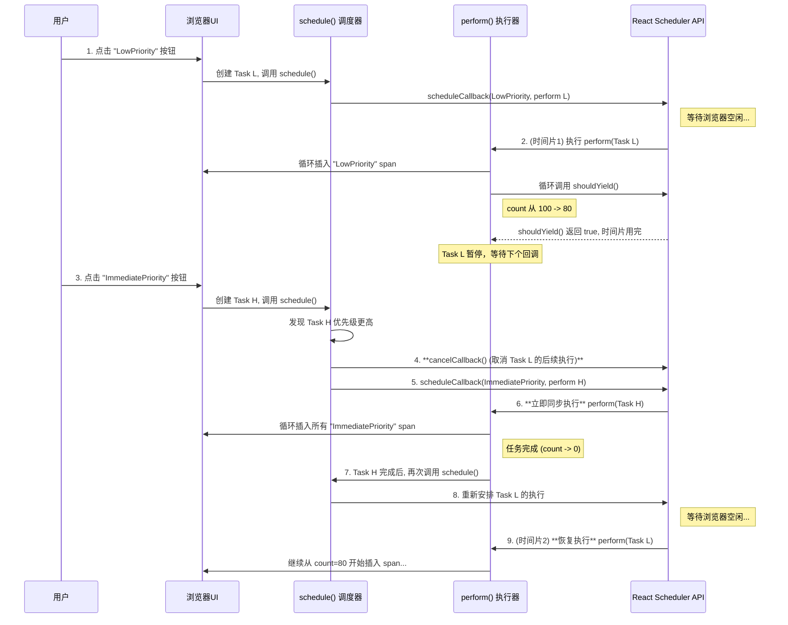

### 场景示例：低优先级任务被高优先级任务中断

1.  **第 1 秒**：用户点击 **"LowPriority"** 按钮，开始一项不紧急的、耗时很长的渲染任务。
2.  **第 1.2 秒**：在低优先级任务执行了一小部分后，用户立即点击了 **"ImmediatePriority"** 按钮，触发了一个必须马上完成的紧急任务。

---

### 流程详解

**步骤 1：低优先级任务启动**

1.  **用户操作**：点击 "LowPriority" 按钮。
2.  **创建任务**：一个 `priority` 为 `LowPriority`，`count` 为 100 的任务（我们称之为 `Task L`）被加入到 `workList`。
3.  **调用 `schedule()`**：
    - `schedule()` 发现 `Task L` 是当前唯一的任务，也是优先级最高的。
    - 它调用 `scheduleCallback(LowPriority, perform.bind(null, Task L))`，请求 `scheduler` 在浏览器空闲时执行 `perform` 函数。
4.  **执行 `perform(Task L)`**：
    - `scheduler` 在一个时间片内开始执行 `perform`。
    - `while` 循环开始运行，`work.count` 从 100 开始减少，并不断在页面上插入 "LowPriority" 的 ``。
    - 假设执行了 20 次循环后（`count` 变为 80），`shouldYield()` 返回 `true`，表示当前时间片已用完。
    - `while` 循环退出，`Task L` 被**暂停**。

**步骤 2：高优先级任务“插队”**

1.  **用户操作**：在 `Task L` 暂停时，用户点击 "ImmediatePriority" 按钮。
2.  **创建任务**：一个 `priority` 为 `ImmediatePriority`，`count` 为 100 的紧急任务（我们称之为 `Task H`）被加入到 `workList`。现在 `workList` 里有两个任务：`[Task H, Task L]`。
3.  **调用 `schedule()`**：
    - `schedule()` 再次被触发。它对 `workList` 排序后，发现 `Task H` 的优先级最高。
    - 它检查到新任务的优先级 `ImmediatePriority` 与上一个任务的优先级 `LowPriority` **不同**。
    - **关键中断点**：`schedule()` 调用 `cancelCallback(cbNode)`，**取消了之前安排的、用于继续执行 `Task L` 的回调**。
    - 接着，它立即调用 `scheduleCallback(ImmediatePriority, perform.bind(null, Task H))` 来安排紧急的 `Task H`。
4.  **执行 `perform(Task H)`**：
    - 因为 `Task H` 的优先级是 `ImmediatePriority`，`needSync` 变量为 `true`。
    - `while` 循环将**无视 `shouldYield()`**，一口气从 `count: 100` 执行到 `count: 0`，同步地将 100 个 "ImmediatePriority" 的 `` 插入页面。这保证了紧急任务的即时性。
    - `Task H` 执行完毕，从 `workList` 中被移除。

**步骤 3：恢复低优先级任务**

1.  **`Task H` 完成后**：`perform(Task H)` 函数的末尾会再次调用 `schedule()`。
2.  **调用 `schedule()`**：
    - `schedule()` 检查 `workList`，发现现在只剩下 `Task L`（并且它的 `count` 仍然是 80）。
    - `Task L` 再次成为优先级最高的任务。
    - `schedule()` 重新调用 `scheduleCallback(LowPriority, perform.bind(null, Task L))`，安排 `Task L` 的后续执行。
3.  **恢复执行 `perform(Task L)`**：
    - 当浏览器再次空闲时，`scheduler` 会继续执行 `Task L`。
    - `perform` 函数从 `count: 80` 开始，继续它的时间分片循环，直到最终完成。

---

### Mermaid 流程图

下图清晰地展示了上述“中断与恢复”的关键流程：

