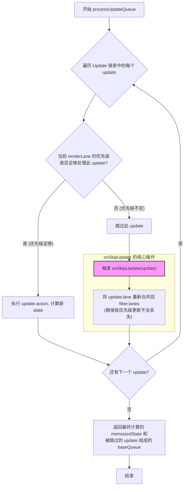
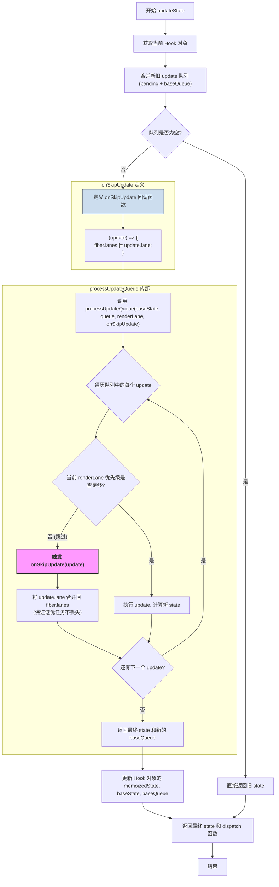

## 作用

跳过链表中的某个 update 时，将这个 update 对应的 lane 还给 fibernode.lanes

## 实现

```js
onSkipUpdate = (update) => {
    const skippeLane = update.lane;
    const fiber = currentlyRenderingFiber as FiberNode;
    fiber.lanes = mergeLanes(fiber.lanes, skippeLane);
}
```

### 参数

update：未消费的 update

## 工作流程

### 触发的作用域

（在整个链条中的相对位置）

在 processUpdateQueue 中，如果该 update 的优先级不够，没有被消费，触发 onSkipUpdate



### 执行的作用域

在 updateState 中

（在整个链条中的相对位置）


