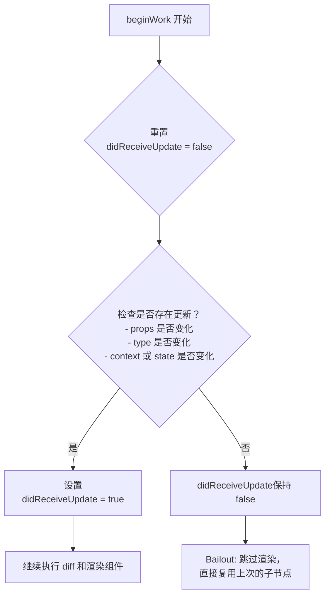

### 流程图

```mermaid
graph TD
    A[beginWork 开始] --> B{重置 <br/>didReceiveUpdate = false};
    B --> C{检查是否存在更新？<br/>- props 是否变化<br/>- type 是否变化<br/>- context 或 state 是否变化};
    C -- 是 --> D[设置 <br/>didReceiveUpdate = true];
    C -- 否 --> E[didReceiveUpdate保持 false];
    D --> F[继续执行 diff 和渲染组件];
    E --> G[Bailout: 跳过渲染，<br/>直接复用上次的子节点];
```
