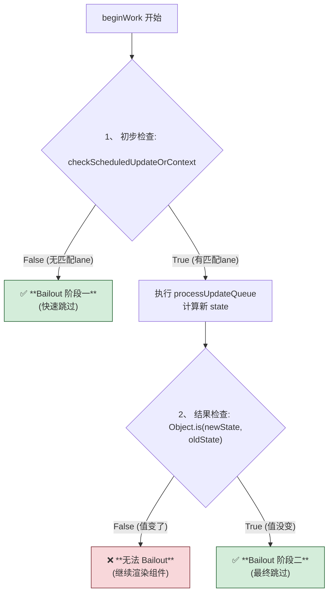

## Bailout 阶段二

update(1) 的情况

- updateHostRoot
- updateFunctionComponent
- updateContextProvider

### updateHostRoot

对比的是 ReactElement 类型的 <App />

### updateFunctionComponent

对比的是前后 state

### updateContextProvider
