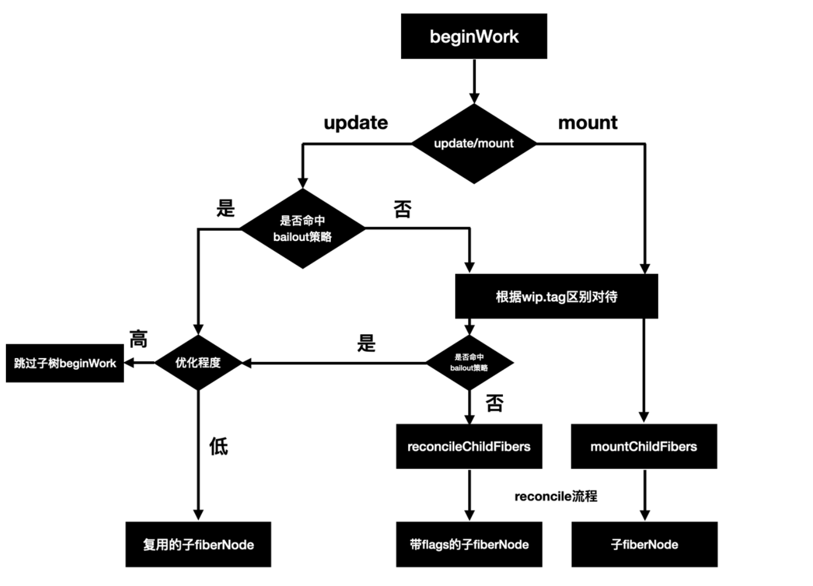

# bailout

### 目的是什么？

减少不必要的子组件 render

### 实现思路

父组件符合 bailout 时，可以直接使用 current.child， 而不通过reconcile生成wip.child

> bailout策略存在于beginWork中

#### bailout是否命中🎯：

- props不变

  比较props变化是通过「全等比较」，使用React.memo后会变为「浅比较」

- state不变

  两种情况可能造成state不变：

  - 不存在update
  - 存在update，但计算得出的state没变化

- context不变

- type不变

### 静态：数据结构

- fiber.lanes
- fiber.childLanes
- didReceiveUpdate

### 函数的实现

### 分工：更新的流程

### 连线：触发的流程
