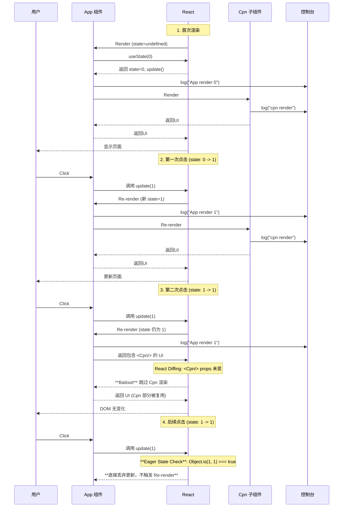

## 直观的感受 eagerState

### 一个例子

mount：正常

第一次点击：正常

第二次点击：触发 bailout, 渲染 <App>

第三...次点击：触发 eagerState, 不会渲染 <App>

```jsx
import { useState } from 'react';
import ReactDOM from 'react-dom/client';

export default function App() {
	const [num, update] = useState(0);
	console.log('App render ', num);
	return (
		<div
			onClick={() => {
				update(1);
			}}
		>
			<Cpn />
		</div>
	);
}

function Cpn() {
	console.log('cpn render');
	return <div>cpn</div>;
}

ReactDOM.createRoot(document.getElementById('root')).render(<App />);
```

### mermaid



### 结果分析

我们一步步来拆解整个过程：

#### 1\. 首次渲染

不关键

#### 2\. 第一次点击

不关键

#### 3\. 第二次点击

- 用户再次点击 `div`，`update(1)` 再次被调用。
- 此时，当前的 state `num` 已经是 `1`，新的 state 仍然是 `1`。
- React 发现你尝试将 state 更新为它当前已经拥有的值 (`Object.is(1, 1)` 为 `true`)。
- ==这里是第一个关键点：React 仍然启动了 re-render 过程。`App` 组件函数被再次执行。==
- `console.log("App render ", num)` 因此打印出 **`App render  1`**。
- 接下来，React 进入 "render phase" 的下一个阶段：diffing (对比差异)。它会比较这次渲染返回的 JSX 和上次渲染的 JSX。它发现子组件 `<Cpn />` 的类型和 props 都没有任何变化。
- **这就是 Bailout 发挥作用的地方**。因为 `<Cpn />` 组件和上次相比没有任何变化，React 会 **跳过 (bail out)** 对 `Cpn` 组件的渲染。它会复用上次的渲染结果。
- 因此，`Cpn` 组件的函数体这次没有执行，控制台也就**不会**打印 `cpn render`。

#### 4\. 后续点击

- 用户第三次、第四次...点击 `div`，`update(1)` 继续被调用。
- **这里是第二个关键点**：这次，控制台**什么也没有**打印。
- **这就是 Eager State 优化发挥作用的地方**。在第二次点击时，React 已经完成了一次“无效”的渲染（组件函数执行了，但子组件被 bail out 且 DOM 没有更新）。在后续的更新中，当 `update(1)` 再次被调用时，React 会**提前计算 (eagerly)**。
- 在调度更新之前，它会使用 `Object.is` 比较新旧 state (`Object.is(1, 1)` 仍然为 `true`)。
- ==由于值完全相同，React 会直接丢弃这次更新请求，根本不会启动一次新的 re-render。==
- 因为没有 re-render，`App` 组件的函数体也就不会执行，所以控制台没有任何输出。
