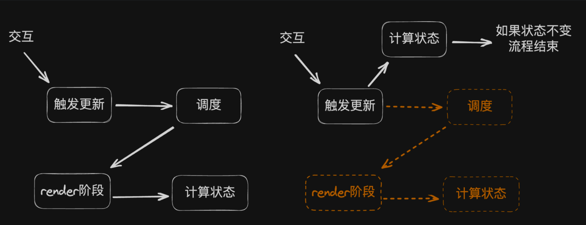

### 目的是什么？作用？

在真正调度一次组件更新之前

状态更新前后没有变化，那就直接跳过这次更新，从而避免任何后续的渲染工作。

### 大概的实现思路

在触发更新时就计算新的 State （正常是在beginWork时）

只有满足「当前fiberNode没有其他更新」才尝试进入eagerState策略。

> ❌ fiber -> u1 -> u2 -> newUpdate

什么意思呢，就是不考虑 fiber 的更新队列中存在因跳过而积累的update

只考虑这种情况：

> fiber -> newUpdate
