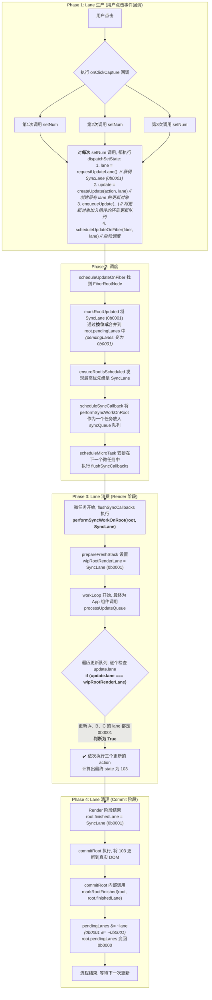

### 核心场景

在 `main.tsx` 中，用户点击 `<ul>` 元素后，会连续三次调用 `setNum`。

```ts
// in demos/test-fc/main.tsx
function App() {
	const [num, setNum] = useState(100);

	return (
		<ul
			onClickCapture={() => {
				setNum((num) => num + 1); // 更新 A
				setNum((num) => num + 1); // 更新 B
				setNum((num) => num + 1); // 更新 C
			}}
		>
			{num}
		</ul>
	);
}
```

### 特别注意

在这个场景中，并不是 `performSyncWorkOnRoot` 函数自身被递归调用了三次，而是 `scheduleSyncCallback` 将三个独立的 `performSyncWorkOnRoot` 任务实例（我们称之为`任务A`, `任务B`, `任务C`）都放入了 `syncQueue` 队列。

然后，`flushSyncCallbacks` 会像执行一个播放列表一样，按顺序执行它们。

1.  **`任务A` (第一次执行) 开始**:

    - 它检查 `root.pendingLanes`，发现里面有 `SyncLane` (`0b0001`)。
    - 它完整地执行了 `workLoop` 和 `commitRoot`，处理了**所有**（A、B、C）的更新，并将 `num` 的状态更新到了 `103`。
    - 在最后，它调用 `markRootFinished`，将 `root.pendingLanes` 中的 `SyncLane` 清除，`pendingLanes` 变回 `0`。

2.  **`任务B` (第二次执行) 开始**:

    - 它检查 `root.pendingLanes`，此时 `pendingLanes` **已经是 `0` 了**。
    - 因此，`getHighestPriorityLane` 返回 `NoLane` (0)。
    - 代码进入 `if (nextLane !== SyncLane)` 这个判断，条件成立。
    - 于是，它执行了一次 `ensureRootIsScheduled`（一个保险检查），然后立即 **`return`**，函数直接退出。

3.  **`任务C` (第三次执行) 开始**:
    - 它的经历和 `任务B` 完全一样，检查发现无事可做，直接 **`return`** 退出。

**只有队列中的第一个 `performSyncWorkOnRoot` 任务会真正执行完整的渲染和提交工作，后续所有针对同一个同步事件的 `performSyncWorkOnRoot` 任务都会在入口处做一个快速检查，然后直接退出。**

这是一种非常高效的“批处理”和“合并更新”的优化策略，确保了 React 不会因为在极短时间内多次调用 `setState` 而进行不必要的重复渲染。

### 完整流程图 (Mermaid)

下面这张图描绘了从 Lane 的“生产”到“消费”再到“清理”的完整生命周期。

代码段



### 流程分步详解

#### **Phase 1: Lane 生产 (用户点击事件回调)**

1. **触发更新**：当用户点击 `<ul>` 元素时，`onClickCapture` 回调函数内的三次 `setNum` 调用被依次执行。
2. **创建与调度更新**：每一次 `setNum` 的调用，都会进入 `fiberHooks.ts` 中的 `dispatchSetState` 函数。

   - **请求 Lane**: 调用 `requestUpdateLane()`，在这个代码库中它总是返回 `SyncLane` (`0b0001`)。
   - **创建 Update 对象**: 调用 `createUpdate(action, lane)`，将更新函数 `(num) => num + 1` 和刚刚获取的 `SyncLane` 打包成一个 `Update` 对象。
   - **入队**: `enqueueUpdate` 将这个 `Update` 对象加入到 `App` 组件对应 Fiber 的更新队列（`updateQueue`）中。这三次调用会形成一个包含三个 `Update` 对象的环形链表。
   - **启动调度**: `scheduleUpdateOnFiber` 被调用，并将 `SyncLane` 传递下去，通知 React 系统“有一个同步任务需要处理”。

#### **Phase 2: 调度**

1. **标记根节点**：`scheduleUpdateOnFiber` 函数会找到应用的根节点（`FiberRootNode`），并调用 `markRootUpdated`。
2. **合并 Lane**: `markRootUpdated` 通过 `mergeLanes` 函数（一个按位或操作 `|`）将 `SyncLane`（`0b0001`）合并到 `root.pendingLanes` 上。因为初始 `pendingLanes` 是 `0`，所以现在 `root.pendingLanes` 的值就是 `0b0001`。
3. **安排执行**: `ensureRootIsScheduled` 函数检查 `pendingLanes`，通过 `getHighestPriorityLane` 确认最高优先级是 `SyncLane`。于是，它将 `performSyncWorkOnRoot` 函数作为一个回调任务，放入一个名为 `syncQueue` 的同步任务队列中，并安排在下一个微任务（microtask）中执行这个队列。

#### **Phase 3: Lane 消费 (Render 阶段)**

1. **启动渲染**: 微任务队列开始执行，`performSyncWorkOnRoot` 被调用。它的一个关键作用就是设置一个全局变量 `wipRootRenderLane` 为本次渲染的 `lane`，即 `SyncLane` (`0b0001`)。
2. **处理更新队列**: 在 `workLoop` 期间，当处理到 `App` 组件时，`processUpdateQueue` 函数被调用。它会遍历之前创建的包含三个 `Update` 对象的链表。
3. **筛选更新**: 在 `processUpdateQueue` 的循环中，它会对每一个 `Update` 对象进行判断：`if (update.lane === renderLane)`。

   - 因为这三个 `Update` 对象的 `lane` 都是 `SyncLane` (`0b0001`)。
   - 而 `renderLane` (即 `wipRootRenderLane`) 也被设置为了 `SyncLane` (`0b0001`)。
   - 所以，这三次更新的判断条件都为 **true**。React 会依次执行它们的 `action`，将 state 从 `100` -> `101` -> `102` -> `103`。

#### **Phase 4: Lane 清理 (Commit 阶段)**

1. **标记完成**: Render 阶段成功结束后，在进入 Commit 阶段之前，React 会执行 `root.finishedLane = lane;`，将 `SyncLane` 记录在 `finishedLane` 上，作为“交接凭证”。
2. **提交DOM**: `commitRoot` 函数被调用，它会执行DOM操作，将界面上显示的数字更新为 `103`。
3. **移除 Lane**: 在 `commitRoot` 函数的逻辑中，会调用 `markRootFinished(root, root.finishedLane)`。这个函数执行 `root.pendingLanes &= ~lane`，也就是 `0b0001 &= ~0b0001`，最终使 `pendingLanes` 变回 `0b0000`。

至此，`SyncLane` 被彻底清理干净，整个更新流程结束，系统恢复到空闲状态，等待下一次更新的到来。
