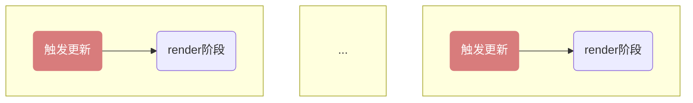
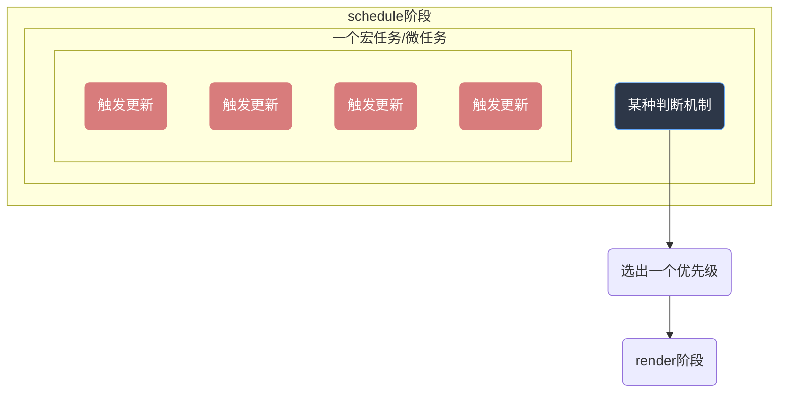
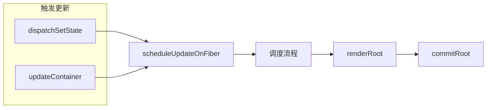

「多次触发更新，只进行一次更新流程」，意味着要达成3个目标：

1. 需要实现一套优先级机制，每个更新都拥有优先级
2. 需要能够合并一个宏任务/微任务中触发的所有更新
3. 需要一套算法，用于决定哪个优先级优先进入render阶段

### 之前

```mermaid
graph TD
    subgraph " "
        A1(触发更新) --> R1(render阶段)
    end

    subgraph " "
        A2(...)
        style A2 fill:none,stroke:none
    end

    subgraph " "
       A3(触发更新) --> R3(render阶段)
    end


style A1 fill:#d87c7c,color:#fff,stroke:#d87c7c
style A3 fill:#d87c7c,color:#fff,stroke:#d87c7c
```

### 之后

```mermaid
graph TB
    subgraph schedule阶段
        direction TB
        subgraph 一个宏任务/微任务

            subgraph " "
                direction TB
                U1(触发更新)
                U2(触发更新)
                U3(触发更新)
                U4(触发更新)
            end
            style U1 fill:#d87c7c,color:#fff,stroke:#d87c7c
            style U2 fill:#d87c7c,color:#fff,stroke:#d87c7c
            style U3 fill:#d87c7c,color:#fff,stroke:#d87c7c
            style U4 fill:#d87c7c,color:#fff,stroke:#d87c7c
            J(某种判断机制)
            style J fill:#2d3748,color:#fff,stroke:#60a5fa
        end
    end

    P(选出一个优先级)
    R(render阶段)

    J --> P --> R
```

### 整体流程

```mermaid
graph LR
    subgraph 触发更新
        A[dispatchSetState]
        B[updateContainer]
    end

    C[scheduleUpdateOnFiber]
    D[renderRoot]
    E[commitRoot]
    F[调度流程]

    A --> C
    B --> C

    D --> E
    C --> F
    F --> D
```
